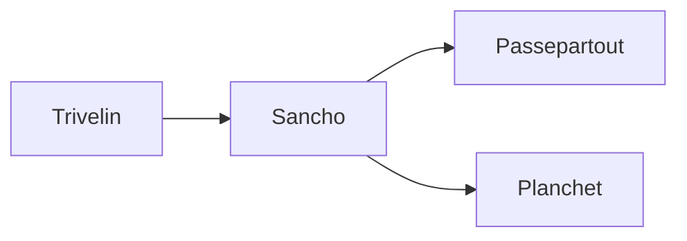

# CLAUDE.md — Scapin

**Version** : v3.3 | **Stack** : Python 3.13 · Svelte 5 · SQLite · FAISS

---

## Mission

Scapin est le **gardien cognitif** de Johan. Il transforme emails et informations
en connaissances organisées via analyse IA multi-pass et mémoire contextuelle.

*"Prendre soin de Johan mieux que Johan lui-même."*

---

## Skills — Quand les Invoquer

| Skill | Invocation | Trigger |
|-------|------------|---------|
| **Valets** | `/valets` | "Où implémenter X ?", "Comment fonctionne Y ?" |
| **Session** | `/session` | "Qu'est-ce qui a été fait ?", début de session |
| **Workflow** | `/workflow` | Conventions de commit, commandes, patterns code |
| **Debug** | `/debug` | "Ça ne marche pas", erreurs, diagnostic, logs |
| **UI** | `/ui` | Composants Svelte, accessibilité, Liquid Glass |
| **API** | `/api` | Endpoints FastAPI, client TypeScript, REST |
| **Perf** | `/perf` | Lenteur, profiling, optimisations, métriques |
| **Tests** | `/tests` | Écrire des tests, pytest, Playwright, mocks |
| **DB** | `/db` | SQLite, FAISS, schéma, migrations, requêtes |

---

## Contexte Johan

- **Langue** : Français (réponses, commentaires, commits)
- **Style** : Direct, concis, technique. Pas d'émojis sauf si demandé
- **Préférences** :
  - Proposer des options plutôt qu'imposer
  - Justifier les choix techniques
  - Atomicité des commits
  - 0 warning toléré (Ruff, TypeScript)

---

## Stack Technique

| Couche | Technologie | Notes |
|--------|-------------|-------|
| Backend | Python 3.13, FastAPI | venv : `.venv/` |
| Frontend | SvelteKit 2, Svelte 5 | Runes ($state, $derived) |
| Database | SQLite | `data/scapin.db` |
| Vectors | FAISS | `data/faiss/` |
| IA | Claude (Haiku → Sonnet → Opus) | Escalade automatique |
| Tests | pytest, Playwright | 95%+ backend, E2E |

---

## Structure du Projet

```
scapin/
├── src/                    # Backend Python
│   ├── trivelin/           # Perception & triage
│   ├── sancho/             # Raisonnement IA
│   ├── passepartout/       # Base de connaissances
│   ├── planchet/           # Planification
│   ├── figaro/             # Orchestration
│   ├── sganarelle/         # Apprentissage
│   ├── frontin/            # API & CLI
│   │   └── api/            # Endpoints FastAPI
│   ├── core/               # Infrastructure partagée
│   └── monitoring/         # Logging, métriques
├── web/                    # Frontend SvelteKit
│   ├── src/
│   │   ├── routes/         # Pages
│   │   └── lib/
│   │       ├── api/        # Client API TypeScript
│   │       ├── components/ # Composants UI
│   │       └── stores/     # État global
│   └── e2e/                # Tests Playwright
├── tests/                  # Tests backend pytest
├── data/                   # Données runtime (gitignored)
│   ├── scapin.db           # SQLite
│   ├── faiss/              # Index vectoriels
│   └── logs/               # Logs JSON
├── docs/
│   ├── user-guide/         # Documentation utilisateur
│   └── plans/              # Plans d'implémentation
└── scripts/                # Scripts utilitaires
```

---

## APIs Externes & Secrets

### Services Connectés

| Service | Usage | Authentification |
|---------|-------|------------------|
| **Anthropic** | Analyse IA (Claude) | API Key dans Keychain |
| **Gmail/IMAP** | Lecture emails | OAuth2 ou App Password |
| **Apple Notes** | Sync notes PKM | AppleScript (local) |
| **iCloud Calendar** | Événements | AppleScript (local) |

### Gestion des Secrets

**Tous les secrets sont dans macOS Keychain** — jamais en fichier.

```bash
# Lister les secrets Scapin
pkm secrets --list

# Ajouter un secret
pkm secrets --set ANTHROPIC_API_KEY

# Debug connexion
pkm health                    # Vérifie tous les services
python scripts/debug_imap.py  # Test IMAP spécifique
```

### Variables d'Environnement

| Variable | Usage | Default |
|----------|-------|---------|
| `SCAPIN_ENV` | Environment (dev/prod) | `dev` |
| `SCAPIN_LOG_LEVEL` | Niveau de log | `INFO` |
| `SCAPIN_DATA_DIR` | Dossier data | `./data` |

---

## Debug Rapide

**Commandes de diagnostic essentielles :**

```bash
# Santé globale
pkm health

# Erreurs récentes
python scripts/view_errors.py --stats

# Logs en temps réel
pkm --verbose --log-format json process --limit 1

# État de la queue
pkm queue && pkm stats

# Test API
curl -s http://localhost:8000/api/health | jq .
```

→ Guide complet de debugging : `/debug`

---

## Glossaire

Termes spécifiques au projet Scapin.

### Concepts IA

| Terme | Définition |
|-------|------------|
| **Multi-Pass** | Analyse itérative (jusqu'à 5 passes) affinant la compréhension jusqu'à 95% de confiance |
| **Escalade** | Bascule auto vers modèle plus puissant (Haiku → Sonnet → Opus) si confiance < 90% |
| **Convergence** | État où les scores entre passes ne varient plus (< 5%), analyse terminée |
| **Confidence** | Score composite 0-100% combinant 5 dimensions (entités, action, complétude...) |
| **Context Influence** | Métadonnées montrant quelles notes PKM ont influencé la décision IA |
| **Early Stop** | Arrêt prématuré si contenu éphémère détecté (OTP, spam) avec confiance ≥ 95% |

### Termes Métier (UI)

| Terme | Définition |
|-------|------------|
| **Péripéties** | Événements entrants en attente (emails, messages) — la "queue" en UI |
| **Fourberies** | Actions préparées par Scapin à approuver (réponse, archivage, tâche...) |
| **Briefing** | Résumé matinal ou pré-réunion (emails prioritaires, RDV, contexte personnes) |
| **Retouche** | Révision espacée SM-2 pour maintenir les notes en mémoire active |
| **Lecture** | Session de révision/enrichissement de notes existantes |

### Termes Techniques

| Terme | Définition |
|-------|------------|
| **Pass** | Une itération du pipeline multi-pass (Grimaud → Bazin → Planchet → Mousqueton) |
| **Queue** | File de traitement des événements, classés par priorité |
| **PerceivedEvent** | Représentation normalisée d'un événement brut après Trivelin |
| **Stop Reason** | Raison d'arrêt d'une passe (confidence_sufficient, max_passes, no_changes) |
| **Enrichment** | Amélioration IA d'une note sans remplacer le contenu existant |

---

## Fichiers Critiques

**Ne pas modifier sans confirmation explicite de Johan :**

| Fichier | Rôle |
|---------|------|
| `src/trivelin/v2_processor.py` | Pipeline Multi-Pass v2.2 |
| `src/sancho/multi_pass_analyzer.py` | Convergence IA |
| `src/passepartout/note_manager.py` | Gestion notes |
| `src/core/config_manager.py` | Configuration globale |

---

## Discipline de Livraison

### Documentation Obligatoire

**RÈGLE : Ne jamais livrer de code sans mettre à jour la documentation.**

| Type de changement | Documentation à mettre à jour |
|--------------------|-------------------------------|
| Nouveau comportement utilisateur | `docs/user-guide/` |
| Modification de workflow existant | `docs/user-guide/` + specs concernées |
| Nouvelle API / endpoint | `ARCHITECTURE.md` + types |
| Nouveau composant complexe | JSDoc/docstring dans le code |
| Changement d'architecture | `ARCHITECTURE.md` |

Si tu ne sais pas où documenter → **demande avant de coder**.

### Conventions Documentation

| Aspect | Convention |
|--------|------------|
| **Langue** | Français (doc, commentaires, commits) |
| **Structure** | Fichiers dédiés dans `docs/` plutôt que tout dans un seul fichier |
| **Diagrammes** | Mermaid (rendu GitHub) plutôt qu'ASCII art |
| **Mise à jour** | Remplacer l'obsolète, ne pas accumuler les versions |

**Arborescence docs recommandée :**
```
docs/
├── user-guide/           # Documentation utilisateur
├── architecture/         # Documentation technique détaillée
│   ├── workflow.md       # Pipeline Multi-Pass
│   ├── autofetch.md      # Système de fetch automatique
│   └── ...
├── specs/                # Spécifications fonctionnelles
└── plans/                # Plans d'implémentation
```

**Diagrammes Mermaid** (exemple) :


### Tests Obligatoires

**RÈGLE : Tester comme un utilisateur, pas comme un développeur.**

| Type de modification | Tests requis |
|----------------------|--------------|
| Fonctionnalité UI | Test E2E Playwright (parcours utilisateur complet) |
| Logique backend | pytest unitaire + intégration |
| Correction de bug | Test de non-régression prouvant le fix |
| Performance critique | Benchmark avant/après documenté |

Les tests doivent simuler le comportement réel de l'utilisateur, pas juste vérifier que le code compile.

### Validation par les Logs (PROACTIVE)

**Après toute modification backend, je dois consulter les logs pour valider.**

```bash
# Lancer avec logs visibles
python scapin.py --verbose process

# Vérifier absence d'erreurs dans les logs JSON
grep -E "(ERROR|WARNING)" data/logs/*.json

# Logs en temps réel pendant dev
tail -f data/logs/processing_$(date +%Y-%m-%d).json
```

**Fichiers de logs :**
| Fichier | Contenu |
|---------|---------|
| `data/logs/processing_YYYY-MM-DD.json` | Historique traitement emails |
| `data/logs/calendar_YYYY-MM-DD.json` | Événements calendrier |
| Console `--verbose` | Debug en temps réel |

**Je dois proactivement :**
- Consulter les logs après chaque modification backend
- Vérifier qu'aucun ERROR/WARNING nouveau n'apparaît
- Utiliser `--verbose --log-format json` pour debug difficile
- Reporter les erreurs trouvées dans les logs à Johan

### Checklist Avant Commit (BLOQUANTE)

**Je dois explicitement valider chaque point avant de proposer un commit :**

```
□ Documentation technique mise à jour (ARCHITECTURE.md si nécessaire)
□ User guide mis à jour si comportement utilisateur modifié (docs/user-guide/)
□ Tests E2E écrits et passants pour tout changement UI
□ Tests unitaires écrits et passants pour tout changement backend
□ Logs vérifiés — aucun ERROR/WARNING nouveau (pour changements backend)
□ Test manuel effectué — décrire exactement ce qui a été vérifié
□ Ruff : 0 warning
□ TypeScript : npm run check passe
□ Pas de TODO, code commenté, ou console.log laissé
```

**Si un point n'est pas coché, je dois l'expliquer et obtenir l'accord de Johan.**

### Hook Pre-commit

Un hook Git vérifie automatiquement les points automatisables :
- ✓ Ruff (Python linting)
- ✓ TypeScript (type checking)
- ✓ Absence de `console.log`
- ⚠ Détection de TODO/FIXME (warning)

Le hook affiche aussi un rappel des vérifications manuelles.

```bash
# Bypass si vraiment nécessaire (non recommandé)
git commit --no-verify
```

---

## Anti-patterns (NE JAMAIS FAIRE)

| Anti-pattern | Pourquoi c'est un problème |
|--------------|---------------------------|
| **Tests "happy path" uniquement** | Les bugs sont dans les cas limites et erreurs |
| **console.log en production** | Utiliser le logger structuré |
| **`any` en TypeScript** | Perte totale de type safety |
| **Commit sans test manuel** | Le code "qui compile" != code qui fonctionne |
| **Plusieurs fonctionnalités par commit** | Impossible à reverter proprement |
| **Documenter "après"** | "Après" n'arrive jamais |
| **Modifier un fichier critique sans demander** | Risque de casser le pipeline |
| **Laisser du code commenté** | Pollue le codebase, Git garde l'historique |

---

## Gestion de Session

### Prévenir la Dégradation

- **Compacter régulièrement** : utiliser `/compact` quand le contexte devient lourd
- **Sessions focalisées** : une fonctionnalité majeure = une session
- **Documenter en cours de route** : ne pas attendre la fin pour écrire la doc

### En Début de Session

1. Consulter `/session` pour le contexte récent
2. Identifier les fichiers de doc à mettre à jour dès le départ
3. Planifier les tests AVANT de coder

### Signaux de Dégradation

Si je commence à :
- Oublier des détails mentionnés plus tôt
- Proposer des solutions incohérentes
- Faire des erreurs de syntaxe inhabituelles

→ Suggérer un `/compact` ou une nouvelle session.

---

## Commandes Essentielles

```bash
./scripts/dev.sh              # Tout démarrer
.venv/bin/pytest tests/ -v    # Tests backend
cd web && npm run check       # Types frontend
cd web && npx playwright test # Tests E2E
```

→ Plus de commandes et conventions de commit : `/workflow`

---

## Les 7 Valets (résumé)

| Valet | Module | Un mot |
|-------|--------|--------|
| Trivelin | `trivelin/` | Perception |
| Sancho | `sancho/` | Raisonnement |
| Passepartout | `passepartout/` | Mémoire |
| Planchet | `planchet/` | Planification |
| Figaro | `figaro/` | Orchestration |
| Sganarelle | `sganarelle/` | Apprentissage |
| Frontin | `frontin/` | Interface |

→ Détails et interactions : `/valets`

---

## Règles Critiques

1. **Confirmer avant de modifier** les fichiers critiques
2. **Un commit = une fonctionnalité** cohérente
3. **Checklist bloquante** — valider chaque point explicitement avant commit
4. **Documentation first** — si pas documenté, pas livré
5. **Skills avant implémentation** — consulter `/valets` pour savoir où coder
6. **Tester comme un utilisateur** — pas juste "ça compile"
7. **Consulter les logs** — vérifier proactivement après chaque modification backend
