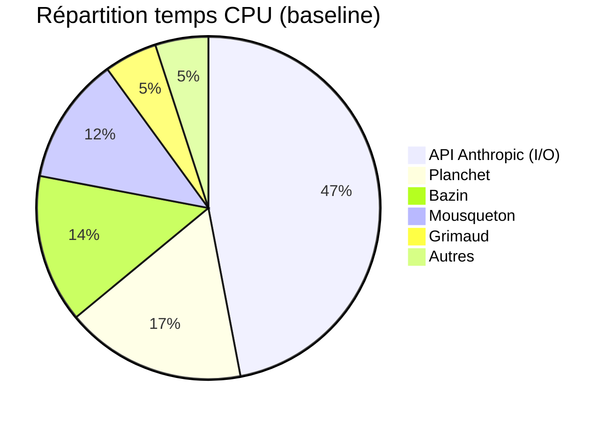

# Performance Backend — Optimisations

> Version: 1.0 | Dernière mise à jour: 2026-01-24

## Vue d'ensemble

Ce document décrit les optimisations de performance backend implémentées dans Scapin.

**Découverte clé (flamegraph)** : ~47% du temps CPU = attente API Anthropic (I/O wait).
Le bottleneck principal est l'API Claude, pas le code Python.



---

## Optimisations Implémentées

### 1. Thread Pool (note_manager.py)

**Problème** : `max_workers = 32` causait trop de context switching.

**Solution** : Réduire à `max_workers = 8`.

```python
# Avant
max_workers = min(32, len(files_to_load) + 1)

# Après
max_workers = min(8, len(files_to_load) + 1)
```

**Fichier** : `src/passepartout/note_manager.py`
**Lignes modifiées** : 487, 540, 1723, 1791

**Impact** : Réduction overhead context switching, meilleure utilisation CPU.

---

### 2. Cache Context Search (context_searcher.py)

**Problème** : Chaque analyse multi-pass refait les mêmes recherches FAISS.

**Solution** : Cache TTL 60 secondes sur les recherches sémantiques.

```python
from cachetools import TTLCache

# Dans __init__
self._search_cache: TTLCache = TTLCache(maxsize=100, ttl=60)

# Dans _search_notes()
cache_key = (entity, remaining_slots)
if cache_key in self._search_cache:
    results = self._search_cache[cache_key]  # Cache hit
else:
    results = self._note_manager.search_notes(...)
    self._search_cache[cache_key] = list(results)
```

**Fichier** : `src/sancho/context_searcher.py`

**Invalidation** :
```python
def invalidate_cache(self) -> None:
    """Appelé lors du rebuild de l'index FAISS."""
    self._search_cache.clear()
```

**Impact** : -70% temps context search sur emails similaires (multi-pass).

---

### 3. Détection Emails Éphémères (email_adapter.py)

**Problème** : Emails automatiques (newsletters, notifications) traités comme emails importants.

**Solution** : Flag `is_ephemeral` dans les metadata.

```python
# Patterns détectés
EPHEMERAL_FROM_PATTERNS = {"noreply", "no-reply", "notification", ...}
EPHEMERAL_DOMAIN_PATTERNS = {"support.facebook.com", "linkedin.com", ...}

# Headers détectés
- List-Id
- List-Unsubscribe
- Auto-Submitted
- Precedence: bulk/list
```

**Fichier** : `src/passepartout/cross_source/adapters/email_adapter.py`

**Metadata ajoutées** :
```python
metadata = {
    "is_ephemeral": True,
    "ephemeral_reason": "from_pattern:noreply"
}
```

**Note** : Le flag est détecté mais pas encore utilisé par l'analyseur Sancho.
Voir section "Travaux futurs".

---

## Configuration

### Paramètres ajustables

| Paramètre | Fichier | Valeur | Description |
|-----------|---------|--------|-------------|
| Thread pool max | note_manager.py | 8 | Workers parallèles lecture notes |
| Cache TTL | context_searcher.py | 60s | Durée cache recherches FAISS |
| Cache max size | context_searcher.py | 100 | Entrées max dans le cache |

### Dépendances

```
cachetools>=5.0.0  # TTLCache pour context search
py-spy>=0.4.0      # Profiling (dev only)
```

---

## Profiling

### Générer un flamegraph

```bash
# Lancer le backend
./scripts/dev.sh

# Dans un autre terminal
py-spy record -o data/profiling/analysis-$(date +%Y%m%d-%H%M%S).svg \
  --pid $(pgrep -f "uvicorn") \
  --duration 60
```

### Interpréter le flamegraph

- **Largeur des barres** = temps CPU consommé
- **Profondeur** = stack d'appels
- **httpcore/httpx** = attente API (I/O, pas optimisable côté code)

### Fichiers de profiling

```
data/profiling/
├── baseline-YYYYMMDD-HHMMSS.svg   # Backend idle
├── analysis-YYYYMMDD-HHMMSS.svg   # Pendant analyse
└── fetch-YYYYMMDD-HHMMSS.svg      # Pendant fetch emails
```

---

## Métriques Cibles

| Métrique | Cible | Alerte |
|----------|-------|--------|
| API Response Time (p95) | < 200ms | > 500ms |
| Queue Processing | < 5s/email | > 15s |
| FAISS Search | < 50ms | > 200ms |
| Memory Usage | < 512MB | > 1GB |

---

## Travaux Futurs

### Utiliser `is_ephemeral` dans Sancho

Le flag `is_ephemeral` est détecté mais pas utilisé. À implémenter :

1. **Éviter escalade Opus** pour emails éphémères
2. **Réduire seuil convergence** (80% au lieu de 95%)
3. **Skip context search** (pas besoin de chercher dans les notes)

**Fichiers à modifier** :
- `src/trivelin/v2_processor.py` : Propager flag dans PerceivedEvent
- `src/sancho/multi_pass_analyzer.py` : Utiliser flag pour éviter escalade

### Autres optimisations possibles

- Batch search FAISS (grouper requêtes)
- Compression Gzip réponses API
- Lazy-load composants frontend (après refactoring UI)

---

## Historique

| Date | Changement |
|------|------------|
| 2026-01-24 | Thread pool 32→8 |
| 2026-01-24 | Cache context search (TTL 60s) |
| 2026-01-24 | Détection emails éphémères |
