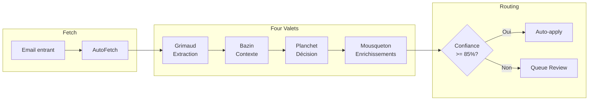

# Workflow Email - Four Valets Pipeline

> Version: 3.0 | Dernière mise à jour: 2026-01-24

## Vue d'ensemble

Le workflow email de Scapin utilise un pipeline multi-pass appelé "Four Valets" pour analyser et traiter automatiquement les emails entrants.



## Four Valets - Pipeline d'analyse

Chaque email passe par 4 phases d'analyse (jusqu'à 5 passes max) :

| Valet | Rôle | Module |
|-------|------|--------|
| **Grimaud** | Extraction des entités et métadonnées | `trivelin/` |
| **Bazin** | Enrichissement contextuel via PKM | `passepartout/` |
| **Planchet** | Décision d'action (archive, répondre, etc.) | `sancho/` |
| **Mousqueton** | Propositions d'enrichissements notes | `planchet/` |

### Convergence Multi-Pass

L'analyse continue jusqu'à :
- **Confiance >= 95%** : Convergence atteinte
- **5 passes max** : Limite de sécurité
- **No changes** : Scores stables entre passes (delta < 5%)

### Escalade de modèle

| Confiance | Modèle | Usage |
|-----------|--------|-------|
| >= 90% | Haiku | Cas simples, newsletters |
| 70-90% | Sonnet | Cas standards |
| < 70% | Opus | Cas complexes, décisions importantes |

## AutoFetch (SC-20)

AutoFetch maintient automatiquement la queue de review peuplée.

### Déclencheurs

| Contexte | Seuil | Comportement |
|----------|-------|--------------|
| **Startup** | < 20 items | Fetch immédiat au démarrage |
| **Runtime** | < 5 items | Fetch après approve/reject (debounce 2s) |

### Cooldowns par source

| Source | Cooldown | Description |
|--------|----------|-------------|
| Email (IMAP) | 2 min | Évite de surcharger le serveur mail |
| Teams | 2 min | Limite API Microsoft |
| Calendar | 5 min | Moins prioritaire |

### Configuration

```yaml
# config/defaults.yaml
autofetch:
  enabled: true
  low_threshold: 5        # Runtime trigger
  startup_threshold: 20   # Startup trigger
  fetch_limit: 20         # Items par fetch
  email_cooldown_minutes: 2
  teams_cooldown_minutes: 2
  calendar_cooldown_minutes: 5
```

## Routage par Confiance (Phase 3)

Le routage détermine si un email nécessite une validation humaine.

### Seuils

| Confiance | Routage | Description |
|-----------|---------|-------------|
| **>= 85%** | Auto-apply | Action exécutée sans intervention |
| **< 85%** | Queue | En attente de validation utilisateur |

### Auto-apply

Quand la confiance est suffisante :
1. L'action IMAP est exécutée (archive, delete, flag...)
2. Les enrichissements sont appliqués aux notes PKM
3. L'item est marqué `resolution.type = "auto_approved"`

**Exception** : L'action `QUEUE` n'est jamais auto-appliquée.

### Configuration

```yaml
autofetch:
  auto_apply_enabled: true
  auto_apply_threshold: 85  # Pourcentage
```

## WebSocket Events

L'UI reçoit des events en temps réel :

| Event | Payload | Description |
|-------|---------|-------------|
| `fetch_started` | `{ source: "email" }` | Fetch en cours |
| `fetch_completed` | `{ source: "email", count: 5 }` | Fetch terminé |
| `item_added` | `{ item: {...} }` | Nouvel item en queue |
| `item_updated` | `{ item: {...}, changes: [...] }` | Item modifié |
| `stats_updated` | `{ stats: {...} }` | Statistiques mises à jour |

## Architecture des fichiers

```
src/
├── frontin/api/services/
│   ├── autofetch_manager.py   # Singleton AutoFetch
│   └── queue_service.py       # Gestion queue + routing trigger
├── trivelin/
│   └── v2_processor.py        # Pipeline Four Valets
├── sancho/
│   └── multi_pass_analyzer.py # Convergence multi-pass
└── core/
    └── config_manager.py      # AutoFetchConfig
```

## Monitoring

### Logs clés

```bash
# Voir les auto-apply
grep "Auto-applied" data/logs/*.json

# Voir les fetch
grep "AutoFetch" data/logs/*.json

# Statistiques
pkm stats
```

### Métriques

| Métrique | Description |
|----------|-------------|
| `autofetch.items_fetched` | Total items récupérés |
| `autofetch.auto_applied` | Items auto-appliqués |
| `autofetch.queued` | Items en queue review |
| `analysis.confidence_avg` | Confiance moyenne |

## Troubleshooting

### Emails non récupérés

1. Vérifier les cooldowns : `pkm health`
2. Vérifier la config IMAP : `python scripts/debug_imap.py`
3. Consulter les logs : `grep "AutoFetch" data/logs/*.json`

### Auto-apply ne fonctionne pas

1. Vérifier `autofetch.auto_apply_enabled: true`
2. Vérifier le seuil : emails peuvent avoir confiance < 85%
3. L'action `QUEUE` n'est jamais auto-appliquée

### Queue toujours vide

1. Vérifier `autofetch.enabled: true`
2. Vérifier les seuils (startup_threshold, low_threshold)
3. Vérifier les cooldowns par source
