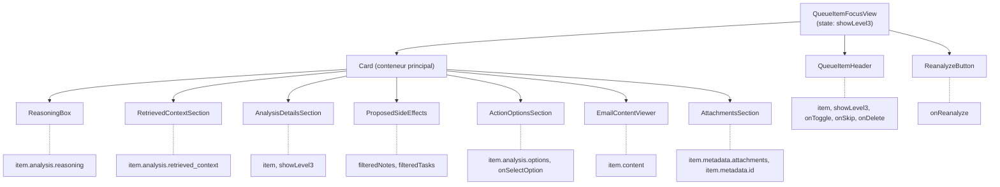
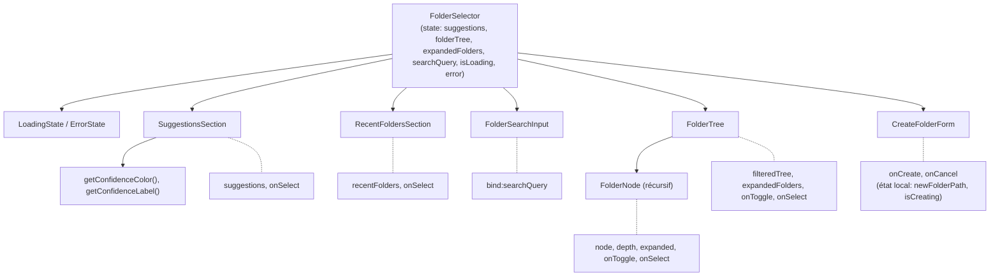

# Plan de Refactoring UI - Session 24 Janvier 2026

## Objectif

Refactoriser les composants UI volumineux et éliminer les duplications de code pour améliorer la maintenabilité, testabilité et réutilisabilité.

## Décisions Clés

| Aspect | Choix |
|--------|-------|
| **Stratégie migration** | Directe (pas de période de transition) |
| **Tests** | Unitaires Vitest + E2E existants |
| **Cards** | BaseCard complet + utilitaires |
| **Priorité** | QueueItemFocusView en premier |

---

## Phase 1 : Utilitaires Communs

**Créer les fichiers utilitaires partagés avant les composants.**

### 1.1 `web/src/lib/utils/iconMappings.ts`

```typescript
// Centralise les mappings d'icônes et couleurs
export const NOTE_TYPE_ICONS: Record<string, string> = {
  personne: '👤',
  organisation: '🏢',
  projet: '📁',
  concept: '💡',
  lieu: '📍',
  evenement: '📅',
  produit: '📦',
  default: '📝'
};

export const MODEL_COLORS: Record<string, { bg: string; text: string }> = {
  haiku: { bg: 'bg-green-500/20', text: 'text-green-500' },
  sonnet: { bg: 'bg-blue-500/20', text: 'text-blue-500' },
  opus: { bg: 'bg-purple-500/20', text: 'text-purple-500' }
};

export const MODEL_LABELS: Record<string, string> = {
  haiku: 'Haiku',
  sonnet: 'Sonnet',
  opus: 'Opus'
};

export const ENTITY_CLASSES: Record<string, string> = {
  person: 'bg-blue-500/10 text-blue-500',
  organization: 'bg-purple-500/10 text-purple-500',
  project: 'bg-green-500/10 text-green-500',
  location: 'bg-orange-500/10 text-orange-500',
  event: 'bg-pink-500/10 text-pink-500',
  default: 'bg-[var(--glass-subtle)] text-[var(--color-text-secondary)]'
};

export function getNoteTypeIcon(type: string): string;
export function getModelColor(model: string): { bg: string; text: string };
export function getEntityClass(type: string): string;
export function getQualityColor(score: number | null): 'success' | 'warning' | 'danger' | 'primary';
```

### 1.2 `web/src/lib/utils/formatters.ts`

```typescript
// Fonctions de formatage réutilisables
export function formatDate(dateStr: string, format?: 'short' | 'time' | 'full'): string;
export function formatDuration(ms: number | null): string;
export function formatDelta(before: number | null, after: number | null): string;
export function formatRelativeTime(date: Date | string): string;
```

### 1.3 Tests unitaires: `web/src/lib/utils/__tests__/`

```
web/src/lib/utils/__tests__/
├── iconMappings.test.ts    (~50 lignes)
└── formatters.test.ts      (~80 lignes)
```

---

## Phase 2 : Composants Génériques

### 2.1 GenericTimeline (`web/src/lib/components/ui/GenericTimeline.svelte`)

**Props:**
```typescript
interface Props<T> {
  items: T[];
  emptyText?: string;
  emptyIcon?: string;
  showConnector?: boolean;
  node: Snippet<[item: T, index: number]>;
  content: Snippet<[item: T, index: number]>;
}
```

**Remplace la structure commune de:**
- `RetoucheTimeline.svelte` (164 lignes)
- `PassTimeline.svelte` (180 lignes)
- `ActivityTimeline.svelte` (172 lignes)

### 2.2 TimelineEntry (`web/src/lib/components/ui/TimelineEntry.svelte`)

**Props:**
```typescript
interface Props {
  title?: string;
  timestamp?: string;
  duration?: number;
  badges?: Array<{ label: string; variant?: 'default' | 'success' | 'warning' | 'error'; icon?: string }>;
  expandable?: boolean;
  children: Snippet;
  details?: Snippet;
}
```

### 2.3 BaseCard (`web/src/lib/components/ui/BaseCard.svelte`)

**Props:**
```typescript
interface Props {
  title: string;
  icon?: string;
  subtitle?: string;
  quality?: number | null;
  badges?: Array<{ label: string; variant?: string; icon?: string }>;
  interactive?: boolean;
  selected?: boolean;
  showQuality?: boolean;
  onclick?: () => void;
  children?: Snippet;      // Zone contenu principal
  actions?: Snippet;       // Zone boutons/liens
}
```

**Structure:**
```svelte
<Card variant="glass" {interactive} {onclick}>
  <!-- Header: icon + title + badges + quality -->
  <div class="flex items-start justify-between mb-4">
    <div class="flex items-center gap-3">
      {#if icon}
        <div class="w-12 h-12 rounded-xl bg-[var(--glass-subtle)] flex items-center justify-center text-2xl">
          {icon}
        </div>
      {/if}
      <div>
        <h2 class="font-semibold">{title}</h2>
        {#if badges?.length}
          <div class="flex gap-2 mt-1">
            {#each badges as badge}
              <Badge class={badge.variant}>...</Badge>
            {/each}
          </div>
        {/if}
      </div>
    </div>
    {#if showQuality && quality !== null}
      <QualityScoreDisplay score={quality} />
    {/if}
  </div>

  <!-- Content slot -->
  {@render children?.()}

  <!-- Actions slot -->
  {#if actions}
    <div class="mt-4 flex justify-end">
      {@render actions()}
    </div>
  {/if}
</Card>
```

### 2.4 Tests: `web/src/lib/components/ui/__tests__/`

```
web/src/lib/components/ui/__tests__/
├── GenericTimeline.test.ts   (~60 lignes)
├── TimelineEntry.test.ts     (~40 lignes)
└── BaseCard.test.ts          (~50 lignes)
```

---

## Phase 3 : Refactoring QueueItemFocusView (PRIORITÉ 1)

**Fichier actuel:** `web/src/lib/components/peripeties/QueueItemFocusView.svelte` (620 lignes)

### Architecture cible:

```
web/src/lib/components/peripeties/queue-item/
├── QueueItemFocusView.svelte       (~100 lignes) - Orchestrateur
├── QueueItemHeader.svelte          (~140 lignes) - Avatar, badges, sparkline, actions
├── ReasoningBox.svelte             (~25 lignes)  - Citation raisonnement IA
├── RetrievedContextSection.svelte  (~90 lignes)  - Contexte récupéré (collapsible)
├── AnalysisDetailsSection.svelte   (~110 lignes) - Entités, transparency, metadata
├── ProposedSideEffects.svelte      (~70 lignes)  - Notes & tâches proposées
├── ActionOptionsSection.svelte     (~50 lignes)  - Boutons décisions
├── EmailContentViewer.svelte       (~70 lignes)  - HTML/Text toggle
├── AttachmentsSection.svelte       (~35 lignes)  - Pièces jointes
└── index.ts                        - Barrel export
```

### Détail des sous-composants:

#### QueueItemHeader.svelte
```typescript
interface Props {
  item: QueueItem;
  showLevel3: boolean;
  onToggleDetails: () => void;
  onSkip: () => void;
  onDelete: (item: QueueItem) => void;
}
// Inclut: Avatar, subject, dates, complexity badges, briefing status, sparkline, PassTimeline (header)
```

#### ReasoningBox.svelte
```typescript
interface Props {
  reasoning: string;
}
// Simple citation stylisée
```

#### RetrievedContextSection.svelte
```typescript
interface Props {
  retrievedContext?: RetrievedContext;
}
// <details> collapsible avec entités, notes, événements, tâches
```

#### AnalysisDetailsSection.svelte
```typescript
interface Props {
  item: QueueItem;
  visible: boolean;  // showLevel3
}
// Entités extraites, context used, analysis transparency, metadata
// Utilise: ConfidenceSparkline, PassTimeline (full), iconMappings
```

#### ProposedSideEffects.svelte
```typescript
interface Props {
  notes: ProposedNote[];
  tasks: ProposedTask[];
}
// Grid layout avec cards pour notes (créer/enrichir) et tâches
```

#### ActionOptionsSection.svelte
```typescript
interface Props {
  options: ActionOption[];
  onSelectOption: (option: ActionOption) => void;
  isProcessing?: boolean;
}
// Grid de boutons avec styling recommandé vs normal
```

#### EmailContentViewer.svelte
```typescript
interface Props {
  content: { html_body?: string; full_text?: string; preview?: string };
}
// État local: showHtmlContent
// Toggle HTML/Text + DOMPurify
```

#### AttachmentsSection.svelte
```typescript
interface Props {
  attachments?: Attachment[];
  emailId: string;
}
// Loop FileAttachment components
```

### Flux de données:



---

## Phase 4 : Refactoring FolderSelector

**Fichier actuel:** `web/src/lib/components/ui/FolderSelector.svelte` (675 lignes)

### Architecture cible:

```
web/src/lib/components/ui/folder-selector/
├── FolderSelector.svelte        (~120 lignes) - Orchestrateur
├── SuggestionsSection.svelte    (~70 lignes)  - Suggestions IA avec confiance
├── RecentFoldersSection.svelte  (~35 lignes)  - Chips récents
├── FolderSearchInput.svelte     (~25 lignes)  - Input recherche
├── FolderTree.svelte            (~90 lignes)  - Conteneur arbre filtré
├── FolderNode.svelte            (~55 lignes)  - Nœud récursif
├── CreateFolderForm.svelte      (~70 lignes)  - Formulaire création
└── index.ts                     - Barrel export
```

### Flux de données:



---

## Phase 5 : Consolidation Timelines

### 5.1 Refactorer RetoucheTimeline → GenericTimeline

```svelte
<script lang="ts">
  import { GenericTimeline, TimelineEntry } from '$lib/components/ui';
  import { getModelColor, MODEL_LABELS } from '$lib/utils/iconMappings';
  import { formatDate, formatDuration } from '$lib/utils/formatters';
</script>

<GenericTimeline items={retouches} emptyText="Aucune retouche enregistrée">
  {#snippet node(item)}
    <div class="w-8 h-8 rounded-full {getModelColor(item.model).bg} flex items-center justify-center">
      <span class={getModelColor(item.model).text}>{MODEL_LABELS[item.model]?.[0] || '?'}</span>
    </div>
  {/snippet}
  {#snippet content(item)}
    <TimelineEntry
      title={item.summary}
      timestamp={item.created_at}
      duration={item.duration_ms}
      badges={[{ label: MODEL_LABELS[item.model] || item.model }]}
    >
      {#if item.quality_delta}
        <span class="text-sm {item.quality_delta > 0 ? 'text-green-500' : 'text-red-500'}">
          {item.quality_delta > 0 ? '+' : ''}{item.quality_delta}
        </span>
      {/if}
    </TimelineEntry>
  {/snippet}
</GenericTimeline>
```

### 5.2 Refactorer PassTimeline → GenericTimeline

Même structure, avec badges spécifiques: escalation, questions, context_used.

### 5.3 Refactorer ActivityTimeline → GenericTimeline

Même structure, conserve les classes CSS spécifiques (.error, .success).

---

## Phase 6 : Consolidation Cards

### 6.1 Refactorer LectureReviewCard → BaseCard

```svelte
<script lang="ts">
  import { BaseCard } from '$lib/components/ui';
  import { getNoteTypeIcon } from '$lib/utils/iconMappings';
  import MarkdownPreview from '$lib/components/notes/MarkdownPreview.svelte';
  import QuestionsForm from './QuestionsForm.svelte';
</script>

<div class="space-y-4">
  <BaseCard
    title={session.note_title}
    icon={getNoteTypeIcon(noteType)}
    quality={session.quality_score}
    showQuality
    badges={[
      ...(recentlyImproved ? [{ label: 'Améliorée', icon: '✨', variant: 'purple' }] : []),
      ...(session.questions.length > 0 ? [{ label: `${session.questions.length} questions`, icon: '❓', variant: 'warning' }] : [])
    ]}
  >
    <div class="p-4 bg-[var(--glass-subtle)] rounded-xl max-h-[300px] overflow-y-auto">
      <MarkdownPreview content={session.note_content} />
    </div>

    {#snippet actions()}
      {#if onViewNote}
        <button onclick={onViewNote} class="text-sm text-[var(--color-accent)]">
          Voir la note complète →
        </button>
      {/if}
    {/snippet}
  </BaseCard>

  {#if session.questions.length > 0}
    <QuestionsForm questions={session.questions} onAnswer={onAnswerQuestions} />
  {/if}
</div>
```

### 6.2 Refactorer FilageLectureCard → BaseCard

### 6.3 Refactorer QuestionCard → BaseCard (si applicable)

---

## Ordre d'Implémentation

| Étape | Tâche | Fichiers | Tests |
|-------|-------|----------|-------|
| 1 | Créer utilitaires | `iconMappings.ts`, `formatters.ts` | `__tests__/*.test.ts` |
| 2 | Créer GenericTimeline | `GenericTimeline.svelte`, `TimelineEntry.svelte` | `__tests__/*.test.ts` |
| 3 | Créer BaseCard | `BaseCard.svelte` | `__tests__/BaseCard.test.ts` |
| 4 | Créer dossier queue-item | 9 nouveaux fichiers | - |
| 5 | Migrer QueueItemFocusView | Déplacer + découper | - |
| 6 | Créer dossier folder-selector | 7 nouveaux fichiers | - |
| 7 | Migrer FolderSelector | Déplacer + découper | - |
| 8 | Refactorer Timelines | 3 fichiers timeline | - |
| 9 | Refactorer Cards | 3 fichiers card | - |
| 10 | Mettre à jour imports | index.ts, pages | - |
| 11 | Tests E2E | Vérifier non-régression | `playwright test` |

---

## Fichiers Critiques

### Nouveaux fichiers à créer (31 fichiers):

**Utilitaires:**
- `web/src/lib/utils/iconMappings.ts`
- `web/src/lib/utils/formatters.ts`
- `web/src/lib/utils/__tests__/iconMappings.test.ts`
- `web/src/lib/utils/__tests__/formatters.test.ts`

**Composants génériques:**
- `web/src/lib/components/ui/GenericTimeline.svelte`
- `web/src/lib/components/ui/TimelineEntry.svelte`
- `web/src/lib/components/ui/BaseCard.svelte`
- `web/src/lib/components/ui/__tests__/GenericTimeline.test.ts`
- `web/src/lib/components/ui/__tests__/TimelineEntry.test.ts`
- `web/src/lib/components/ui/__tests__/BaseCard.test.ts`

**QueueItem (9 fichiers):**
- `web/src/lib/components/peripeties/queue-item/QueueItemFocusView.svelte`
- `web/src/lib/components/peripeties/queue-item/QueueItemHeader.svelte`
- `web/src/lib/components/peripeties/queue-item/ReasoningBox.svelte`
- `web/src/lib/components/peripeties/queue-item/RetrievedContextSection.svelte`
- `web/src/lib/components/peripeties/queue-item/AnalysisDetailsSection.svelte`
- `web/src/lib/components/peripeties/queue-item/ProposedSideEffects.svelte`
- `web/src/lib/components/peripeties/queue-item/ActionOptionsSection.svelte`
- `web/src/lib/components/peripeties/queue-item/EmailContentViewer.svelte`
- `web/src/lib/components/peripeties/queue-item/AttachmentsSection.svelte`
- `web/src/lib/components/peripeties/queue-item/index.ts`

**FolderSelector (7 fichiers):**
- `web/src/lib/components/ui/folder-selector/FolderSelector.svelte`
- `web/src/lib/components/ui/folder-selector/SuggestionsSection.svelte`
- `web/src/lib/components/ui/folder-selector/RecentFoldersSection.svelte`
- `web/src/lib/components/ui/folder-selector/FolderSearchInput.svelte`
- `web/src/lib/components/ui/folder-selector/FolderTree.svelte`
- `web/src/lib/components/ui/folder-selector/FolderNode.svelte`
- `web/src/lib/components/ui/folder-selector/CreateFolderForm.svelte`
- `web/src/lib/components/ui/folder-selector/index.ts`

### Fichiers à supprimer après migration:
- `web/src/lib/components/ui/FolderSelector.svelte`
- `web/src/lib/components/peripeties/QueueItemFocusView.svelte`

### Fichiers à modifier:
- `web/src/lib/components/memory/RetoucheTimeline.svelte`
- `web/src/lib/components/flux/PassTimeline.svelte`
- `web/src/lib/components/valets/ActivityTimeline.svelte`
- `web/src/lib/components/memory/LectureReviewCard.svelte`
- `web/src/lib/components/memory/FilageLectureCard.svelte`
- `web/src/lib/components/ui/index.ts`
- `web/src/lib/components/peripeties/index.ts`

### Pages impactées:
- `web/src/routes/flux/+page.svelte`
- `web/src/routes/notes/[id]/+page.svelte`
- `web/src/routes/valets/+page.svelte`
- `web/src/routes/memoires/+page.svelte`

---

## Vérification

### Tests à exécuter:
```bash
# Tests unitaires Vitest
cd web && npm run test

# Tests E2E complets
cd web && npx playwright test

# Tests spécifiques aux composants modifiés
npx playwright test flux.spec.ts notes.spec.ts valets.spec.ts memoires.spec.ts

# Vérification types
npm run check

# Lint
npm run lint
```

### Vérification manuelle:
1. **Flux page**: Ouvrir un élément, vérifier header/reasoning/actions
2. **Flux page**: Tester FolderSelector (suggestions, recherche, création)
3. **Note detail**: Vérifier RetoucheTimeline s'affiche correctement
4. **Valets page**: Vérifier ActivityTimeline fonctionne
5. **Mémoires page**: Vérifier LectureReviewCard, FilageLectureCard
6. **Mobile responsive**: Vérifier tous les composants sur 375px

---

---

## Phase 7 : Tests

### 7.1 Tests Unitaires Vitest

**Structure des tests:**
```
web/src/lib/
├── utils/__tests__/
│   ├── iconMappings.test.ts
│   └── formatters.test.ts
└── components/ui/__tests__/
    ├── GenericTimeline.test.ts
    ├── TimelineEntry.test.ts
    └── BaseCard.test.ts
```

#### `iconMappings.test.ts` (~50 lignes)
```typescript
import { describe, it, expect } from 'vitest';
import {
  NOTE_TYPE_ICONS,
  MODEL_COLORS,
  getNoteTypeIcon,
  getModelColor,
  getEntityClass,
  getQualityColor
} from '../iconMappings';

describe('iconMappings', () => {
  describe('getNoteTypeIcon', () => {
    it('should return correct icon for known types', () => {
      expect(getNoteTypeIcon('personne')).toBe('👤');
      expect(getNoteTypeIcon('projet')).toBe('📁');
    });

    it('should return default icon for unknown types', () => {
      expect(getNoteTypeIcon('unknown')).toBe('📝');
      expect(getNoteTypeIcon('')).toBe('📝');
    });

    it('should be case-insensitive', () => {
      expect(getNoteTypeIcon('PERSONNE')).toBe('👤');
      expect(getNoteTypeIcon('Projet')).toBe('📁');
    });
  });

  describe('getModelColor', () => {
    it('should return correct colors for known models', () => {
      expect(getModelColor('haiku')).toEqual({ bg: 'bg-green-500/20', text: 'text-green-500' });
      expect(getModelColor('sonnet')).toEqual({ bg: 'bg-blue-500/20', text: 'text-blue-500' });
      expect(getModelColor('opus')).toEqual({ bg: 'bg-purple-500/20', text: 'text-purple-500' });
    });

    it('should return default for unknown models', () => {
      const result = getModelColor('unknown');
      expect(result).toBeDefined();
    });
  });

  describe('getQualityColor', () => {
    it('should return success for high scores', () => {
      expect(getQualityColor(80)).toBe('success');
      expect(getQualityColor(100)).toBe('success');
    });

    it('should return warning for medium scores', () => {
      expect(getQualityColor(60)).toBe('warning');
      expect(getQualityColor(79)).toBe('warning');
    });

    it('should return danger for low scores', () => {
      expect(getQualityColor(0)).toBe('danger');
      expect(getQualityColor(59)).toBe('danger');
    });

    it('should return primary for null', () => {
      expect(getQualityColor(null)).toBe('primary');
    });
  });
});
```

#### `formatters.test.ts` (~80 lignes)
```typescript
import { describe, it, expect, beforeEach, afterEach, vi } from 'vitest';
import { formatDate, formatDuration, formatDelta, formatRelativeTime } from '../formatters';

describe('formatters', () => {
  describe('formatDate', () => {
    it('should format date in short format', () => {
      const result = formatDate('2026-01-24T10:30:00Z', 'short');
      expect(result).toContain('24');
      expect(result).toContain('janv');
    });

    it('should format date in time format', () => {
      const result = formatDate('2026-01-24T10:30:00Z', 'time');
      expect(result).toMatch(/\d{2}:\d{2}/);
    });

    it('should format date in full format', () => {
      const result = formatDate('2026-01-24T10:30:00Z', 'full');
      expect(result).toContain('2026');
    });

    it('should handle invalid dates gracefully', () => {
      expect(() => formatDate('invalid')).not.toThrow();
    });
  });

  describe('formatDuration', () => {
    it('should format milliseconds', () => {
      expect(formatDuration(500)).toBe('500ms');
      expect(formatDuration(999)).toBe('999ms');
    });

    it('should format seconds', () => {
      expect(formatDuration(1000)).toBe('1.0s');
      expect(formatDuration(1500)).toBe('1.5s');
      expect(formatDuration(60000)).toBe('60.0s');
    });

    it('should handle null', () => {
      expect(formatDuration(null)).toBe('');
    });

    it('should handle zero', () => {
      expect(formatDuration(0)).toBe('0ms');
    });
  });

  describe('formatDelta', () => {
    it('should format positive delta with plus sign', () => {
      expect(formatDelta(50, 75)).toBe('+25');
    });

    it('should format negative delta', () => {
      expect(formatDelta(75, 50)).toBe('-25');
    });

    it('should format zero delta', () => {
      expect(formatDelta(50, 50)).toBe('=');
    });

    it('should handle null values', () => {
      expect(formatDelta(null, 50)).toBe('');
      expect(formatDelta(50, null)).toBe('');
      expect(formatDelta(null, null)).toBe('');
    });
  });

  describe('formatRelativeTime', () => {
    beforeEach(() => {
      vi.useFakeTimers();
      vi.setSystemTime(new Date('2026-01-24T12:00:00Z'));
    });

    afterEach(() => {
      vi.useRealTimers();
    });

    it('should format recent times', () => {
      expect(formatRelativeTime('2026-01-24T11:59:00Z')).toContain('minute');
    });

    it('should format hours ago', () => {
      expect(formatRelativeTime('2026-01-24T10:00:00Z')).toContain('heure');
    });

    it('should format days ago', () => {
      expect(formatRelativeTime('2026-01-22T12:00:00Z')).toContain('jour');
    });
  });
});
```

#### `GenericTimeline.test.ts` (~60 lignes)
```typescript
import { describe, it, expect } from 'vitest';
import { render, screen } from '@testing-library/svelte';
import GenericTimeline from '../GenericTimeline.svelte';

describe('GenericTimeline', () => {
  it('should render empty state when no items', () => {
    render(GenericTimeline, {
      props: {
        items: [],
        emptyText: 'Aucun élément'
      }
    });

    expect(screen.getByText('Aucun élément')).toBeInTheDocument();
  });

  it('should render items when provided', () => {
    const items = [
      { id: '1', title: 'Item 1' },
      { id: '2', title: 'Item 2' }
    ];

    render(GenericTimeline, {
      props: {
        items,
        // Note: snippets are tested via integration tests
      }
    });

    // Verify container structure exists
    expect(document.querySelector('.timeline-container')).toBeInTheDocument();
  });

  it('should show connector lines between items', () => {
    const items = [
      { id: '1', title: 'Item 1' },
      { id: '2', title: 'Item 2' }
    ];

    render(GenericTimeline, {
      props: {
        items,
        showConnector: true
      }
    });

    const connectors = document.querySelectorAll('.timeline-connector');
    expect(connectors.length).toBeGreaterThan(0);
  });

  it('should hide connector lines when disabled', () => {
    const items = [{ id: '1', title: 'Item 1' }];

    render(GenericTimeline, {
      props: {
        items,
        showConnector: false
      }
    });

    const connectors = document.querySelectorAll('.timeline-connector');
    expect(connectors.length).toBe(0);
  });
});
```

#### `BaseCard.test.ts` (~50 lignes)
```typescript
import { describe, it, expect, vi } from 'vitest';
import { render, screen, fireEvent } from '@testing-library/svelte';
import BaseCard from '../BaseCard.svelte';

describe('BaseCard', () => {
  it('should render title', () => {
    render(BaseCard, { props: { title: 'Test Card' } });
    expect(screen.getByText('Test Card')).toBeInTheDocument();
  });

  it('should render icon when provided', () => {
    render(BaseCard, { props: { title: 'Test', icon: '📝' } });
    expect(screen.getByText('📝')).toBeInTheDocument();
  });

  it('should render badges when provided', () => {
    render(BaseCard, {
      props: {
        title: 'Test',
        badges: [
          { label: 'Badge 1', icon: '✨' },
          { label: 'Badge 2' }
        ]
      }
    });

    expect(screen.getByText('Badge 1')).toBeInTheDocument();
    expect(screen.getByText('Badge 2')).toBeInTheDocument();
  });

  it('should call onclick when clicked', async () => {
    const handleClick = vi.fn();
    render(BaseCard, {
      props: {
        title: 'Clickable Card',
        interactive: true,
        onclick: handleClick
      }
    });

    const card = screen.getByRole('button');
    await fireEvent.click(card);

    expect(handleClick).toHaveBeenCalledOnce();
  });

  it('should not be clickable when not interactive', () => {
    render(BaseCard, {
      props: {
        title: 'Static Card',
        interactive: false
      }
    });

    expect(screen.queryByRole('button')).not.toBeInTheDocument();
  });
});
```

### 7.2 Tests E2E Playwright

**Fichiers E2E existants à vérifier:**
- `web/e2e/pages/peripeties.spec.ts` - QueueItemFocusView
- `web/e2e/pages/peripeties-detail.spec.ts` - QueueItemFocusView détaillé
- `web/e2e/pages/notes.spec.ts` - RetoucheTimeline
- `web/e2e/pages/valets.spec.ts` - ActivityTimeline
- `web/e2e/pages/memoires.spec.ts` - Cards mémoire

**Nouveaux tests E2E à ajouter (optionnel):**

```typescript
// web/e2e/components/folder-selector.spec.ts
import { test, expect } from '@playwright/test';

test.describe('FolderSelector', () => {
  test.beforeEach(async ({ page }) => {
    await page.goto('/flux');
    // Ouvrir un élément pour afficher FolderSelector
  });

  test('should display suggestions', async ({ page }) => {
    await page.click('[data-testid="open-folder-selector"]');
    await expect(page.locator('[data-testid="suggestions-section"]')).toBeVisible();
  });

  test('should filter tree on search', async ({ page }) => {
    await page.click('[data-testid="open-folder-selector"]');
    await page.fill('[data-testid="folder-search"]', 'projets');
    await expect(page.locator('[data-testid="folder-tree"]')).toContainText('projets');
  });

  test('should create new folder', async ({ page }) => {
    await page.click('[data-testid="open-folder-selector"]');
    await page.click('[data-testid="create-folder-btn"]');
    await page.fill('[data-testid="new-folder-input"]', 'Nouveau Dossier');
    await page.click('[data-testid="confirm-create"]');
    await expect(page.locator('[data-testid="folder-tree"]')).toContainText('Nouveau Dossier');
  });
});
```

### 7.3 Stratégie de Tests

| Type | Scope | Outils | Couverture Cible |
|------|-------|--------|------------------|
| **Unitaires** | Utilitaires (pure functions) | Vitest | 100% |
| **Unitaires** | Composants génériques | Vitest + Testing Library | 80% |
| **Intégration** | Sous-composants avec props | Vitest + Testing Library | 60% |
| **E2E** | Workflows utilisateur | Playwright | Scénarios critiques |

**Commandes:**
```bash
# Tests unitaires
cd web && npm run test

# Tests unitaires avec couverture
cd web && npm run test -- --coverage

# Tests E2E
cd web && npx playwright test

# Tests E2E en mode debug
cd web && npx playwright test --debug
```

---

## Phase 8 : Documentation Technique

### 8.1 JSDoc pour Utilitaires

```typescript
// web/src/lib/utils/iconMappings.ts

/**
 * Mapping des types de notes vers leurs icônes emoji
 * @example
 * NOTE_TYPE_ICONS['personne'] // '👤'
 */
export const NOTE_TYPE_ICONS: Record<string, string> = { ... };

/**
 * Retourne l'icône emoji correspondant à un type de note
 * @param type - Le type de note (personne, projet, concept, etc.)
 * @returns L'emoji correspondant ou l'emoji par défaut (📝)
 * @example
 * getNoteTypeIcon('personne') // '👤'
 * getNoteTypeIcon('unknown') // '📝'
 */
export function getNoteTypeIcon(type: string): string { ... }

/**
 * Retourne les classes CSS de couleur pour un modèle IA
 * @param model - Le nom du modèle (haiku, sonnet, opus)
 * @returns Un objet avec les classes bg et text
 * @example
 * getModelColor('haiku') // { bg: 'bg-green-500/20', text: 'text-green-500' }
 */
export function getModelColor(model: string): { bg: string; text: string } { ... }

/**
 * Détermine la variante de couleur en fonction d'un score de qualité
 * @param score - Score de 0 à 100, ou null
 * @returns La variante de couleur pour le composant Badge/Progress
 * @example
 * getQualityColor(85) // 'success'
 * getQualityColor(65) // 'warning'
 * getQualityColor(null) // 'primary'
 */
export function getQualityColor(score: number | null): 'success' | 'warning' | 'danger' | 'primary' { ... }
```

### 8.2 JSDoc pour Composants

```svelte
<!-- web/src/lib/components/ui/GenericTimeline.svelte -->
<script lang="ts">
  /**
   * GenericTimeline - Composant de timeline réutilisable
   *
   * @component
   * @example
   * <GenericTimeline items={myItems} emptyText="Aucun élément">
   *   {#snippet node(item)}
   *     <div class="node">{item.icon}</div>
   *   {/snippet}
   *   {#snippet content(item)}
   *     <div>{item.title}</div>
   *   {/snippet}
   * </GenericTimeline>
   */

  import type { Snippet } from 'svelte';

  interface Props<T> {
    /** Liste des éléments à afficher dans la timeline */
    items: T[];
    /** Message affiché quand la liste est vide */
    emptyText?: string;
    /** Icône affichée avec le message vide */
    emptyIcon?: string;
    /** Afficher les lignes de connexion entre les éléments */
    showConnector?: boolean;
    /** Snippet pour le rendu du nœud (point/icône) de chaque élément */
    node: Snippet<[item: T, index: number]>;
    /** Snippet pour le rendu du contenu de chaque élément */
    content: Snippet<[item: T, index: number]>;
  }
</script>
```

### 8.3 README Composants

**Créer `web/src/lib/components/ui/README.md`:**

```markdown
# Composants UI Scapin

## Composants Génériques

### GenericTimeline

Timeline verticale réutilisable avec slots pour personnalisation.

**Props:**
| Prop | Type | Default | Description |
|------|------|---------|-------------|
| `items` | `T[]` | required | Éléments à afficher |
| `emptyText` | `string` | `undefined` | Message si liste vide |
| `emptyIcon` | `string` | `undefined` | Icône pour état vide |
| `showConnector` | `boolean` | `true` | Lignes entre éléments |
| `node` | `Snippet` | required | Rendu du point/icône |
| `content` | `Snippet` | required | Rendu du contenu |

**Exemple:**
```svelte
<GenericTimeline items={events} emptyText="Aucun événement">
  {#snippet node(item)}
    <div class="w-8 h-8 rounded-full bg-blue-500">{item.icon}</div>
  {/snippet}
  {#snippet content(item)}
    <TimelineEntry title={item.title} timestamp={item.date}>
      <p>{item.description}</p>
    </TimelineEntry>
  {/snippet}
</GenericTimeline>
```

### TimelineEntry

Entrée de timeline avec header, badges et contenu expandable.

**Props:**
| Prop | Type | Default | Description |
|------|------|---------|-------------|
| `title` | `string` | `undefined` | Titre de l'entrée |
| `timestamp` | `string` | `undefined` | Date/heure ISO |
| `duration` | `number` | `undefined` | Durée en ms |
| `badges` | `Badge[]` | `[]` | Badges à afficher |
| `expandable` | `boolean` | `false` | Section détails |
| `children` | `Snippet` | required | Contenu principal |
| `details` | `Snippet` | `undefined` | Contenu expandable |

### BaseCard

Card avec header structuré (icon, title, badges, quality).

**Props:**
| Prop | Type | Default | Description |
|------|------|---------|-------------|
| `title` | `string` | required | Titre de la card |
| `icon` | `string` | `undefined` | Emoji/icône |
| `subtitle` | `string` | `undefined` | Sous-titre |
| `quality` | `number` | `undefined` | Score 0-100 |
| `badges` | `Badge[]` | `[]` | Badges header |
| `showQuality` | `boolean` | `false` | Afficher score |
| `interactive` | `boolean` | `false` | Clickable |
| `onclick` | `() => void` | `undefined` | Handler click |
| `children` | `Snippet` | `undefined` | Contenu |
| `actions` | `Snippet` | `undefined` | Zone actions |

## Utilitaires

### iconMappings.ts

Mappings centralisés pour icônes et couleurs.

```typescript
import { getNoteTypeIcon, getModelColor, getQualityColor } from '$lib/utils/iconMappings';

getNoteTypeIcon('personne')  // '👤'
getModelColor('haiku')       // { bg: '...', text: '...' }
getQualityColor(85)          // 'success'
```

### formatters.ts

Fonctions de formatage pour dates et durées.

```typescript
import { formatDate, formatDuration, formatDelta } from '$lib/utils/formatters';

formatDate('2026-01-24T10:00:00Z', 'short')  // '24 janv. 10:00'
formatDuration(1500)                          // '1.5s'
formatDelta(50, 75)                           // '+25'
```
```

### 8.4 Mise à jour ARCHITECTURE.md

**Ajouter section dans `ARCHITECTURE.md`:**

```markdown
## Frontend - Composants UI

### Composants Génériques (Phase 3.2+)

| Composant | Fichier | Usage |
|-----------|---------|-------|
| `GenericTimeline` | `ui/GenericTimeline.svelte` | Timeline verticale réutilisable |
| `TimelineEntry` | `ui/TimelineEntry.svelte` | Entrée de timeline |
| `BaseCard` | `ui/BaseCard.svelte` | Card avec header structuré |

### Organisation des Composants

```
web/src/lib/components/
├── ui/                          # Composants primitifs
│   ├── folder-selector/         # FolderSelector refactorisé
│   ├── GenericTimeline.svelte   # Timeline générique
│   ├── TimelineEntry.svelte     # Entrée timeline
│   ├── BaseCard.svelte          # Card avec header
│   ├── Card.svelte              # Card de base
│   └── ...
├── peripeties/                  # Composants flux/queue
│   ├── queue-item/              # QueueItemFocusView refactorisé
│   └── ...
└── memory/                      # Composants mémoire
    └── ...
```

### Utilitaires Partagés

```
web/src/lib/utils/
├── iconMappings.ts              # Icônes et couleurs
├── formatters.ts                # Formatage dates/durées
└── __tests__/                   # Tests unitaires
```
```

---

## Phase 9 : Guide Utilisateur (Interne)

### 9.1 Guide Migration pour Développeurs

**Créer `docs/dev/ui-component-migration.md`:**

```markdown
# Guide de Migration UI Components

## Contexte

Suite au refactoring UI de janvier 2026, plusieurs composants ont été découpés
et des utilitaires partagés ont été créés.

## Changements Majeurs

### 1. QueueItemFocusView

**Avant:**
```svelte
import QueueItemFocusView from '$lib/components/peripeties/QueueItemFocusView.svelte';
```

**Après:**
```svelte
import { QueueItemFocusView } from '$lib/components/peripeties/queue-item';
```

L'API reste identique, seul l'import change.

### 2. FolderSelector

**Avant:**
```svelte
import FolderSelector from '$lib/components/ui/FolderSelector.svelte';
```

**Après:**
```svelte
import { FolderSelector } from '$lib/components/ui/folder-selector';
```

L'API reste identique.

### 3. Nouveaux Utilitaires

Pour les mappings d'icônes et couleurs, utiliser les utilitaires centralisés :

```svelte
<script>
  // Avant (dupliqué dans chaque composant)
  const typeIcons = { personne: '👤', projet: '📁', ... };

  // Après
  import { getNoteTypeIcon, getQualityColor } from '$lib/utils/iconMappings';
</script>
```

### 4. Utiliser GenericTimeline

Pour créer une nouvelle timeline, utiliser le composant générique :

```svelte
<script>
  import { GenericTimeline, TimelineEntry } from '$lib/components/ui';
</script>

<GenericTimeline items={myItems} emptyText="Aucun élément">
  {#snippet node(item)}
    <MyNodeComponent {item} />
  {/snippet}
  {#snippet content(item)}
    <TimelineEntry title={item.title}>
      <MyContent {item} />
    </TimelineEntry>
  {/snippet}
</GenericTimeline>
```

### 5. Utiliser BaseCard

Pour les cards avec header structuré :

```svelte
<script>
  import { BaseCard } from '$lib/components/ui';
</script>

<BaseCard
  title="Ma Card"
  icon="📝"
  quality={85}
  showQuality
  badges={[{ label: 'Tag', icon: '🏷️' }]}
>
  <p>Contenu de la card</p>

  {#snippet actions()}
    <button>Action</button>
  {/snippet}
</BaseCard>
```

## Tests

Après toute modification de ces composants, exécuter :

```bash
cd web
npm run test           # Tests unitaires
npm run check          # Vérification types
npx playwright test    # Tests E2E
```
```

### 9.2 Changelog

**Ajouter dans `CHANGELOG.md` (ou créer si inexistant):**

```markdown
## [3.3.0] - 2026-01-24

### Added
- `GenericTimeline` - Composant timeline réutilisable avec slots
- `TimelineEntry` - Composant d'entrée de timeline
- `BaseCard` - Composant card avec header structuré
- `iconMappings.ts` - Utilitaires centralisés pour icônes et couleurs
- `formatters.ts` - Utilitaires de formatage dates/durées
- Tests unitaires Vitest pour utilitaires et composants génériques

### Changed
- `QueueItemFocusView` découpé en 9 sous-composants (queue-item/)
- `FolderSelector` découpé en 7 sous-composants (folder-selector/)
- `RetoucheTimeline` utilise maintenant `GenericTimeline`
- `PassTimeline` utilise maintenant `GenericTimeline`
- `ActivityTimeline` utilise maintenant `GenericTimeline`
- `LectureReviewCard` utilise maintenant `BaseCard`
- `FilageLectureCard` utilise maintenant `BaseCard`

### Removed
- Ancien fichier monolithique `QueueItemFocusView.svelte`
- Ancien fichier monolithique `FolderSelector.svelte`
- Duplications de `typeIcons` dans les composants

### Migration
Voir `docs/dev/ui-component-migration.md` pour le guide de migration.
```

---

## Métriques de Succès

| Métrique | Avant | Après (cible) |
|----------|-------|---------------|
| Lignes QueueItemFocusView | 620 | ~100 (orchestrateur) |
| Lignes FolderSelector | 675 | ~120 (orchestrateur) |
| Lignes dupliquées Timelines | ~500 | ~100 (shared) |
| Lignes dupliquées Cards | ~300 | ~50 (shared via BaseCard) |
| Composants réutilisables | 0 | 4 (GenericTimeline, TimelineEntry, BaseCard, utilitaires) |
| Fichiers > 300 lignes | 4 | 0 |
| Tests unitaires | 1 fichier | 7 fichiers |
| Couverture utilitaires | 0% | 100% |
| Documentation JSDoc | Partielle | Complète |
| README composants | 0 | 1 |
| Guide migration | 0 | 1 |
