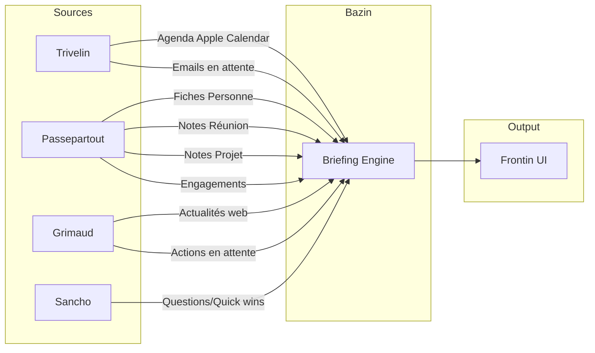

# Bazin — Préparation & Anticipation

**Date** : 27 janvier 2026
**Statut** : Design validé
**Auteur** : Johan + Claude
**Phase Master Roadmap** : Phase 5 (Optionnel)

---

## Skills à consulter

| Skill | Usage |
|-------|-------|
| `/valets` | Architecture des valets, où implémenter |
| `/api` | Endpoints FastAPI pour briefings |
| `/ui` | Composants Svelte pour briefings |
| `/tests` | Patterns pytest + Playwright |

---

## Fichiers critiques (CLAUDE.md)

Ce plan **ne modifie pas** de fichiers critiques. Il crée un nouveau module `src/bazin/`.

Bazin **interagit** avec :
- `src/trivelin/` (lecture calendrier, emails)
- `src/passepartout/` (fiches personnes, notes réunion)
- `src/grimaud/` (actualités fraîches si implémenté)
- `src/sancho/router.py` (génération questions/quick wins)

---

## Résumé exécutif

Bazin est le valet de la préparation et de l'anticipation. Il transforme Scapin d'un système réactif en un véritable **coach personnel** qui prépare Johan pour chaque journée et chaque interaction.

**Fonctionnalités clés** :
- **Briefing matinal** — Vue d'ensemble de la journée, préparé automatiquement
- **Briefing contextuel** — Préparation de réunion comme un coach (2h avant)
- **Alertes** — Engagements non tenus, contacts négligés, anniversaires
- **Suggestions** — Recommandations d'actions prioritaires

---

## Contexte

### Avant (Scapin réactif)

- Email arrive → analyse → propose des actions
- Note due pour révision → déclenche lecture/retouche
- Johan demande → Scapin répond

### Après (Scapin proactif avec Bazin)

- Johan ouvre Scapin → briefing de la journée prêt
- 2h avant un RDV → briefing de préparation complet
- Engagement non tenu → alerte J+1
- Emails en attente → suggestion d'ordre de traitement

---

## Bazin — Le 9ème valet

### Origine du nom

> *"Bazin était un homme de trente-cinq à quarante ans, doux, paisible, grassouillet, occupé à lire des livres pieux."*
> — Alexandre Dumas, Les Trois Mousquetaires

Bazin servait Aramis, le mousquetaire stratège et réfléchi. Il préparait méticuleusement, anticipait les besoins, et conseillait avec sagesse.

### Mission

Préparer Johan pour chaque journée et chaque interaction. Anticiper, alerter, et suggérer — toujours avec calme et méthode.

### Place dans l'architecture

| Valet | Module | Mission |
|-------|--------|---------|
| Trivelin | `trivelin/` | Perception |
| Sancho | `sancho/` | Raisonnement IA |
| Passepartout | `passepartout/` | Mémoire PKM |
| Planchet | `planchet/` | Planification |
| Figaro | `figaro/` | Orchestration |
| Sganarelle | `sganarelle/` | Apprentissage |
| Frontin | `frontin/` | Interface (API & CLI) |
| Grimaud | `grimaud/` | Gardien PKM |
| **Bazin** | `bazin/` | **Préparation & Anticipation** |

---

## Briefing matinal

### Génération

- **Quand** : Automatiquement vers 6h
- **Disponible** : Dès l'ouverture de Scapin
- **Refresh** : Recalculé si données changent (nouvel email urgent)

### Structure

```
┌─────────────────────────────────────────────────────────────────────────────┐
│  BRIEFING — Lundi 27 janvier 2026                                           │
├─────────────────────────────────────────────────────────────────────────────┤
│                                                                             │
│  ⚡ CHARGE COGNITIVE                                                        │
│  Journée intense (4 réunions) — Peu de temps pour deep work                 │
│  💡 Créneau libre : 11h-12h → Idéal pour traiter les 2 emails urgents       │
│                                                                             │
│  📖 NOTE DU JOUR                                                            │
│  Relis "Stratégie négociation" avant ton call avec Marc        [Ouvrir]     │
│                                                                             │
│  📅 AGENDA (3 RDV)                                                          │
│  ───────────────────────────────────────────────────────────────────────    │
│  09:30  Call Marc Dupont (TechCorp)                      [Voir briefing]    │
│         → Dernière tension sur budget, rester factuel                       │
│  14:00  Réunion AWCS — Conseil syndical                  [Voir briefing]    │
│         → Vote travaux façade, préparer arguments                           │
│  17:00  Point projet Alpha                               [Voir briefing]    │
│                                                                             │
│  📧 EMAILS PRIORITAIRES (5)                                                 │
│  ───────────────────────────────────────────────────────────────────────    │
│  🔴 Pierre Martin — Relance contrat (attente 4j)        [Traiter]           │
│  🔴 Sophie (AWCS) — Question urgente devis              [Traiter]           │
│  🟡 Newsletter importante — À lire                      [Plus tard]         │
│  → Commence par Pierre, il attend une décision                              │
│                                                                             │
│  ⚠️ ENGAGEMENTS À SUIVRE (2)                                                │
│  ───────────────────────────────────────────────────────────────────────    │
│  🔴 Jean devait envoyer specs — J+2, pas de nouvelles   [Relancer]          │
│  🟡 Livraison fournisseur prévue demain                 [Surveiller]        │
│                                                                             │
│  👥 RAPPELS RELATIONNELS                                                    │
│  ───────────────────────────────────────────────────────────────────────    │
│  🎂 Anniversaire Damien dans 3 jours                    [Préparer]          │
│  💬 Pas de nouvelles de Maman depuis 3 semaines         [Appeler]           │
│                                                                             │
│  🛡️ GRIMAUD                                                                 │
│  ───────────────────────────────────────────────────────────────────────    │
│  3 actions en attente de validation                     [Voir]              │
│  12 notes enrichies cette nuit                                              │
│                                                                             │
│  📊 MÉTÉO PROJETS                                                           │
│  ───────────────────────────────────────────────────────────────────────    │
│  🟢 Projet Alpha — En bonne voie                                            │
│  🟡 Vente Nautil — Attente réponse acheteur (5j)        [Relancer ?]        │
│  🔴 Migration serveur — Deadline J-3, 2 tâches restantes                    │
│                                                                             │
└─────────────────────────────────────────────────────────────────────────────┘
```

### Sections

| Section | Contenu |
|---------|---------|
| **Charge cognitive** | Estimation de l'intensité de la journée |
| **Créneau libre** | Meilleur moment pour deep work / traiter emails |
| **Note du jour** | Suggestion de note à relire (objectif, concept utile) |
| **Agenda** | RDV du jour avec contexte rapide sur participants |
| **Emails prioritaires** | Non traités, urgents, > 48h + ordre recommandé |
| **Engagements** | Deadlines proches, promesses non tenues |
| **Rappels relationnels** | Anniversaires, contacts négligés |
| **Grimaud** | État du gardien PKM |
| **Météo projets** | État des projets HIGH PRIORITY |

---

## Briefing contextuel (Coach RDV)

### Déclenchement

- **Quand** : 2h avant le RDV
- **Où** : Badge sur l'agenda + section dédiée
- **Refresh** : Si nouvel email d'un participant arrive

### Structure

```
┌─────────────────────────────────────────────────────────────────────────────┐
│  BRIEFING RDV — Call Marc Dupont (TechCorp)                         09:30   │
├─────────────────────────────────────────────────────────────────────────────┤
│                                                                             │
│  📊 SCORE DE PRÉPARATION : 85%                                              │
│  ├─ ✓ Objectif défini                                                       │
│  ├─ ✓ Documents identifiés                                                  │
│  ├─ ✗ Pas relu la note "Stratégie négociation"                              │
│  └─ [Améliorer ma préparation]                                              │
│                                                                             │
│  🎯 OBJECTIF                                                                │
│  ───────────────────────────────────────────────────────────────────────    │
│  Valider le budget Q2 et obtenir son accord sur le planning                 │
│  [Non défini ? Définir maintenant]                                          │
│                                                                             │
│  👤 PARTICIPANT                                                             │
│  ───────────────────────────────────────────────────────────────────────    │
│  Marc Dupont — Directeur Innovation, TechCorp                               │
│  Relation : Client depuis 2024, 12 interactions                             │
│  Dernier échange : Email il y a 5 jours (budget Q2)                         │
│                                                                             │
│  💬 STYLE RELATIONNEL                                                       │
│  ───────────────────────────────────────────────────────────────────────    │
│  → Marc est direct et orienté résultats                                     │
│  → Préfère les chiffres aux longs discours                                  │
│  → Sensible à la ponctualité et au respect des engagements                  │
│                                                                             │
│  ⚠️ POINTS DE VIGILANCE                                                     │
│  ───────────────────────────────────────────────────────────────────────    │
│  🔴 Tension sur le budget en décembre — Éviter de rouvrir ce sujet          │
│  🟡 Contraintes internes — Ne pas le mettre en porte-à-faux                 │
│                                                                             │
│  📰 ACTUALITÉ FRAÎCHE                                                       │
│  ───────────────────────────────────────────────────────────────────────    │
│  • TechCorp lève 10M€ série B (Les Échos, 20 jan)                           │
│  • Marc interviewé sur l'IA dans l'industrie (LinkedIn, 18 jan)             │
│                                                                             │
│  📜 HISTORIQUE RÉUNIONS                                                     │
│  ───────────────────────────────────────────────────────────────────────    │
│  15 déc 2025 — Point projet (45min)                                         │
│  → Décisions : Budget validé à 50k, planning Q1 accepté                     │
│  → Action : Johan envoie specs (fait ✓)                                     │
│                                                                             │
│  03 nov 2025 — Kick-off (1h)                                                │
│  → Décisions : Go projet, Marc = sponsor interne                            │
│                                                                             │
│  📁 DOCUMENTS À AVOIR                                                       │
│  ───────────────────────────────────────────────────────────────────────    │
│  • Budget Q2 v3.xlsx (mentionné dans son dernier email)      [Ouvrir]       │
│  • Planning projet Alpha                                     [Ouvrir]       │
│                                                                             │
│  ❓ QUESTIONS SUGGÉRÉES                                                     │
│  ───────────────────────────────────────────────────────────────────────    │
│  • "Quelles sont tes contraintes côté TechCorp pour Q2 ?"                   │
│  • "Comment vois-tu la collaboration sur les 6 prochains mois ?"            │
│  • "Y a-t-il des points bloquants que je devrais anticiper ?"               │
│                                                                             │
│  🚀 QUICK WIN — Pour bien démarrer                                          │
│  ───────────────────────────────────────────────────────────────────────    │
│  "Félicite-le pour la levée de fonds TechCorp annoncée la semaine           │
│   dernière — ça montre que tu suis son actualité"                           │
│                                                                             │
│  📧 ÉCHANGES RÉCENTS (< 48h)                                                │
│  ───────────────────────────────────────────────────────────────────────    │
│  Aucun échange dans les 48 dernières heures                                 │
│                                                                             │
└─────────────────────────────────────────────────────────────────────────────┘
```

### Sections

| Section | Contenu | Source |
|---------|---------|--------|
| **Score de préparation** | Checklist de préparation avec % | Calculé |
| **Objectif** | But de la réunion | Note Réunion ou à définir |
| **Participant** | Fiche résumée | Passepartout |
| **Style relationnel** | Comment aborder la personne | Fiche Personne |
| **Points de vigilance** | Tensions, sujets sensibles | Fiche Personne |
| **Actualité fraîche** | News récentes participant/entreprise | Grimaud (web) |
| **Historique réunions** | Réunions passées et décisions | Notes Réunion |
| **Documents** | Fichiers à avoir sous la main | Emails récents |
| **Questions suggérées** | Questions pertinentes | IA (Sonnet) |
| **Quick win** | Accroche pour bien démarrer | IA (Sonnet) |
| **Échanges récents** | Emails < 48h | Trivelin |

---

## Alertes

### Engagements

| Type | Déclenchement | Exemple |
|------|---------------|---------|
| **Engagement reçu non tenu** | J+1 après deadline | "Jean devait livrer specs — J+2, pas de nouvelles" |
| **Engagement donné** | J-1 avant deadline | "Tu as promis le rapport à Sophie pour demain" |

### Rappels relationnels

Seuils par défaut (**paramétrables dans l'UI**) :

| Type de relation | Seuil d'alerte |
|------------------|----------------|
| Famille proche | 2 semaines sans contact |
| Ami proche | 1 mois |
| Collègue/client actif | 2 semaines |
| Contact professionnel | 2 mois |
| Connaissance | Jamais |

### Anniversaires et dates

Délai d'alerte **configurable par importance** :
- Haute importance : 1 semaine avant
- Moyenne : 3 jours avant
- Basse : La veille

---

## Suggestions d'actions

Scapin ne liste pas, il **recommande** avec l'ordre de traitement :

```
┌─────────────────────────────────────────────────────────────────────────────┐
│  💡 SUGGESTION — Que faire maintenant ?                                     │
├─────────────────────────────────────────────────────────────────────────────┤
│                                                                             │
│  1. Réponds à Pierre (contrat, attend depuis 4j)              [Traiter]     │
│     → "Salut Pierre, voici ma décision sur..."                              │
│                                                                             │
│  2. Relance Jean pour les specs (J+2)                         [Relancer]    │
│     → Draft : "Jean, où en es-tu sur les specs ?"                           │
│                                                                             │
│  3. Prépare ton call de 14h (briefing prêt)                   [Voir]        │
│                                                                             │
│  ⏸️ Peut attendre : 3 emails non urgents, 2 newsletters                     │
│                                                                             │
└─────────────────────────────────────────────────────────────────────────────┘
```

---

## Architecture technique

### Structure du module

```
src/bazin/                         # Préparation & Anticipation
├── __init__.py
├── morning_briefing.py            # Briefing matinal
├── meeting_coach.py               # Briefing contextuel RDV
├── alerts.py                      # Alertes engagements et relationnelles
├── suggestions.py                 # Recommandations d'actions
├── preparation_scorer.py          # Score de préparation RDV
└── scheduler.py                   # Planification des générations
```

### Sources de données



### Flux de génération

#### Briefing matinal (6h)

1. Récupérer agenda du jour (Apple Calendar)
2. Pour chaque RDV : identifier participants → charger fiches Personne
3. Scanner emails : en attente, urgents, > 48h
4. Scanner engagements : deadlines J-1, J+1
5. Scanner relations : seuils dépassés, anniversaires proches
6. Calculer charge cognitive (nb réunions, durée totale)
7. Identifier créneaux libres
8. Sélectionner note du jour (objectif en cours, concept utile)
9. Récupérer état Grimaud (actions en attente)
10. Récupérer météo projets HIGH PRIORITY
11. Assembler et stocker le briefing

#### Briefing contextuel (2h avant RDV)

1. Identifier participants du RDV
2. Charger fiches Personne complètes
3. Charger historique réunions avec ces personnes
4. Extraire style relationnel depuis fiches
5. Identifier points de vigilance (tensions, sujets sensibles)
6. Scanner emails < 48h avec participants
7. Recherche web : actualités fraîches participants/entreprises
8. Identifier documents mentionnés dans échanges récents
9. Générer questions suggérées (IA)
10. Générer quick win (IA)
11. Calculer score de préparation
12. Assembler et notifier

### Utilisation de l'IA

| Élément | Généré par |
|---------|------------|
| Style relationnel | Extrait de la fiche (pas d'IA) |
| Points de vigilance | Extrait de la fiche + analyse IA si nécessaire |
| Questions suggérées | IA (Sonnet) avec contexte |
| Quick win | IA (Sonnet) avec actualités |
| Suggestion d'ordre d'actions | IA (Haiku) — rapide, pas cher |

---

## Coûts estimés

| Composant | Fréquence | Coût unitaire | Total/mois |
|-----------|-----------|---------------|------------|
| Briefing matinal | 1/jour | $0.02 (Haiku) | $0.60 |
| Briefing contextuel | ~3/jour | $0.05 (Sonnet) | $4.50 |
| Suggestions d'actions | Continu | $0.01 (Haiku) | $2-3 |
| **Total Bazin** | | | **~$7-8/mois** |

---

## Interface utilisateur

### Intégration dans Scapin

| Route | Contenu |
|-------|---------|
| `/` (Dashboard) | Widget briefing matinal |
| `/briefing` | Briefing matinal complet |
| `/briefing/rdv/:id` | Briefing contextuel d'un RDV |
| Paramètres | Configuration seuils relationnels, délais anniversaires |

### Actions intégrées

Chaque item a une action directe :
- **[Traiter]** → Ouvre l'email avec contexte
- **[Voir briefing]** → Ouvre le briefing contextuel du RDV
- **[Relancer]** → Prépare un email de relance
- **[Appeler]** → Affiche le numéro / ouvre FaceTime
- **[Ouvrir]** → Ouvre le document/la note

---

## Questions ouvertes

1. **API Calendrier** — Utiliser EventKit (natif) ou CalDAV ?
2. **Stockage briefings** — SQLite ou fichiers JSON ?
3. **Refresh automatique** — WebSocket ou polling ?
4. **Multi-calendrier** — Gérer plusieurs agendas ?

---

## Prochaines étapes

1. Créer le module `src/bazin/`
2. Implémenter le briefing matinal (plus simple)
3. Intégrer avec Apple Calendar
4. Implémenter le briefing contextuel
5. Ajouter les alertes
6. Créer les routes UI
7. Tests E2E du cycle complet

---

## Relation avec Grimaud

Bazin et Grimaud sont complémentaires :

| Aspect | Grimaud | Bazin |
|--------|---------|-------|
| **Focus** | Notes (PKM) | Journée (interactions) |
| **Mode** | Continu, arrière-plan | Événementiel (matin, avant RDV) |
| **Actions** | Fusionne, enrichit, lie | Informe, alerte, suggère |
| **Autonomie** | Agit si confiance > seuil | Prépare, Johan agit |

Bazin **consomme** le travail de Grimaud :
- Actualités fraîches → intégrées dans briefings contextuels
- Fiches enrichies → utilisées pour style relationnel, historique
- État Grimaud → affiché dans briefing matinal

---

---

## Documentation à mettre à jour

| Document | Section | Changement |
|----------|---------|------------|
| `ARCHITECTURE.md` | Valets | Section Bazin (9ème valet) |
| `CLAUDE.md` | Glossaire | Briefing = Résumé matinal ou pré-réunion |
| `CLAUDE.md` | Les 9 Valets | Ajouter Bazin |
| `.claude/skills/valets.md` | Description | Rôle de Bazin |
| `docs/user-guide/` | Nouveau fichier | Guide utilisateur Briefings |

---

## Tests requis (CLAUDE.md)

### Backend (pytest)

| Test | Fichier | Type |
|------|---------|------|
| Génération briefing matinal | `tests/unit/test_bazin_morning.py` | Unitaire |
| Génération briefing contextuel | `tests/unit/test_bazin_meeting.py` | Unitaire |
| Calcul charge cognitive | `tests/unit/test_bazin_morning.py` | Unitaire |
| Score de préparation | `tests/unit/test_bazin_meeting.py` | Unitaire |
| Alertes engagements | `tests/unit/test_bazin_alerts.py` | Unitaire |
| Suggestions d'actions | `tests/unit/test_bazin_suggestions.py` | Unitaire |
| **Cas limites** | | |
| Jour sans RDV | `test_bazin_morning.py` | Edge case |
| Participant inconnu PKM | `test_bazin_meeting.py` | Edge case |
| Calendrier vide | `test_bazin_morning.py` | Error case |

### Frontend (Playwright E2E)

| Test | Fichier | Parcours |
|------|---------|----------|
| Briefing matinal complet | `bazin-briefing.spec.ts` | Ouvrir `/briefing` → Toutes sections visibles |
| Briefing contextuel | `bazin-briefing.spec.ts` | Cliquer RDV → Briefing avec participant |
| Action depuis briefing | `bazin-briefing.spec.ts` | Cliquer [Traiter] → Email s'ouvre |
| Score préparation | `bazin-briefing.spec.ts` | Vérifier score et facteurs affichés |

---

## Checklist de livraison (CLAUDE.md)

```
□ Documentation ARCHITECTURE.md mise à jour (section Bazin)
□ CLAUDE.md mis à jour (glossaire + valets)
□ User guide créé dans docs/user-guide/
□ Tests unitaires backend passants
□ Tests E2E Playwright passants
□ Logs vérifiés — aucun ERROR/WARNING
□ Test manuel : briefing matinal à 6h généré
□ Test manuel : briefing contextuel 2h avant RDV
□ Ruff : 0 warning
□ TypeScript : npm run check passe
□ Pas de TODO, code commenté, ou console.log
```

---

*Document créé le 27 janvier 2026*
