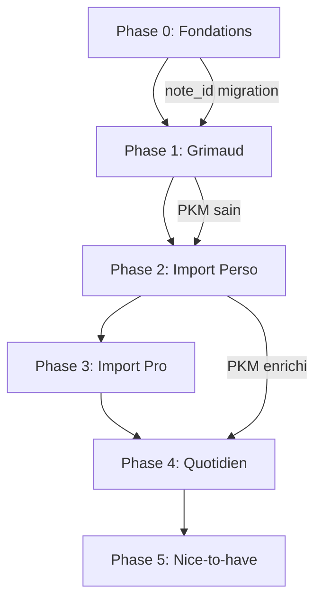

# Scapin — Master Roadmap

**Date** : 27 janvier 2026
**Statut** : Plan validé
**Objectif** : PKM sain → Import historique → Usage quotidien

---

## Skills à consulter par phase

| Phase | Skills |
|-------|--------|
| 0 | `/db` (migration), `/valets` (Passepartout) |
| 1 | `/valets` (Grimaud), `/api`, `/ui`, `/tests` |
| 2-3 | `/valets` (Trivelin, Sancho), `/workflow` |
| 4 | `/workflow` |
| 5 | `/valets`, `/api`, `/ui`, `/tests` |

---

## Fichiers critiques (CLAUDE.md)

Les phases 0-3 peuvent toucher des fichiers critiques nécessitant confirmation Johan :

| Fichier | Phase | Modification |
|---------|-------|--------------|
| `src/passepartout/note_manager.py` | 0 | Migration note_id |
| `src/trivelin/v2_processor.py` | 2-3 | Flag `--historical` |

---

## Vision

Transformer Scapin d'un prototype fonctionnel en un assistant cognitif complet :

1. **PKM en bonne santé** — Notes consolidées, sans doublons ni fragmentation
2. **Historique intégré** — 30 000 emails (5 ans) analysés et triés
3. **Usage quotidien** — Nouveaux emails traités avec un PKM riche
4. **Features avancées** — Chat, briefings, OmniFocus (optionnel)

---

## État des Lieux

### Plans Actifs

| Plan | Statut | Phase |
|------|--------|-------|
| `migration-note-id-format.md` | À faire | 0 |
| `prompt-architecture-design.md` | Référence | — |
| `model-economics-analysis.md` | Référence | — |
| `grimaud-guardian-design.md` | À implémenter | 1 |
| `ui-refactoring.md` | À implémenter | 1-5 |
| `bazin-proactivity-design.md` | Optionnel | 5 |
| `omnifocus-integration-design.md` | Optionnel | 5 |
| `chat-memory-design.md` | Optionnel | 5 |

### Plans Supprimés

| Plan | Raison |
|------|--------|
| `retouche-lifecycle-v2.md` | Remplacé par Grimaud |
| `nouveaux-types-notes.md` | Déjà implémenté |

---

## Phases d'Implémentation

### Phase 0 : Fondations (1-2 jours)

**Objectif** : Préparer le terrain pour les phases suivantes.

| Tâche | Détail | Statut | Plan source |
|-------|--------|--------|-------------|
| Migration note_id | Éliminer 14 collisions de noms | À faire | `migration-note-id-format.md` |
| Prompt caching | Cache Anthropic (-50% coût) | ✅ Fait | `router.py:_call_claude_with_cache()` |
| Injecter Canevas | Corriger gap dans retouche | À faire | `prompt-architecture-design.md` |

**Critère de succès** : 855 notes indexées (au lieu de 841), coût API réduit.

---

### Phase 1 : Grimaud — PKM Health (3-5 jours)

**Objectif** : Nettoyer et consolider le PKM existant AVANT l'import historique.

| Composant | Priorité | Description |
|-----------|----------|-------------|
| Scanner | Haute | Sélection et priorisation des notes |
| Analyzer | Haute | Détection problèmes (FAISS similarity > 0.85) |
| Executor | Haute | Application actions + snapshots |
| History | Haute | Versioning 30 jours |
| UI Dashboard | Moyenne | Vue santé globale |

**Actions supportées** :

| Action | Seuil auto | Description |
|--------|------------|-------------|
| Fusion | 0.95+ | Combiner notes sur même sujet |
| Liaison | 0.85+ | Créer wikilinks |
| Restructuration | 0.90+ | Réorganiser selon template |
| Enrichissement | 0.90+ | Compléter sections vides |
| Métadonnées | 0.85+ | Corriger frontmatter |

**Critère de succès** : PKM consolidé, score santé globale > 90%.

**Plan source** : `grimaud-guardian-design.md`

---

### Phase 2 : Import Emails Perso (1 jour code + 2-3 nuits)

**Objectif** : Analyser 15 000 emails personnels, enrichir le PKM, trier archive/delete.

#### Modifications techniques au pipeline

**Fichiers à modifier** :

| Fichier | Modification |
|---------|--------------|
| `src/frontin/cli.py` | Ajouter flag `--historical` |
| `src/trivelin/v2_processor.py` | Passer `historical=True` au prompt |
| `src/sancho/prompts/analyse/user.j2` | Injecter contexte historique |
| `src/sancho/models.py` | Ajouter action `DELETE` aux choix |

**Comportement du flag `--historical`** :

| Aspect | Normal | Historique |
|--------|--------|------------|
| Flag | `--process` | `--historical` |
| Actions proposées | Archive, Flag, Queue | **Archive ou Delete uniquement** |
| Urgence | Oui | Non (tout est vieux) |
| Prompt | Standard | Adapté au contexte historique |
| Enrichissement PKM | Oui | Oui (même traitement) |
| Early stop | Spam, OTP | Étendu (newsletters non lues, notifs système) |

**Modifications au prompt** (dans `user.j2`) :

```jinja2

---
⚠️ CONTEXTE HISTORIQUE

Cet email date de {{ email_date }}. C'est un import historique.

**Objectif** :
1. Extraire TOUTES les informations de valeur (personnes, faits, décisions, coordonnées)
2. Décider : **ARCHIVE** (valeur durable) ou **DELETE** (éphémère, obsolète)

**Ne propose PAS** d'actions "à traiter" — cet email est ancien.

**Critères ARCHIVE** :
- Conversation avec personne connue du cercle proche
- Information factuelle de valeur durable
- Engagement ou décision mentionné
- Coordonnées, dates importantes
- Contenu personnel significatif

**Critères DELETE** :
- OTP, codes de vérification
- Newsletters jamais ouvertes
- Confirmations automatiques (commande, réservation passée)
- Notifications système
- Spam, publicités

```

**Nouveau champ dans la réponse JSON** :

```json
{
  "action": "archive" | "delete",  // Pas de "flag" ni "queue" en mode historique
  "delete_reason": "otp" | "newsletter" | "notification" | "spam" | "obsolete" | null
}
```

#### Critères Archive/Delete

| ARCHIVE | DELETE |
|---------|--------|
| Conversation avec personne connue | OTP, codes vérification |
| Info factuelle de valeur | Newsletters non lues |
| Engagement/décision mentionné | Confirmations automatiques |
| Coordonnées, dates importantes | Notifications système |
| Cercle proche | Spam, pubs |

#### Exécution

```bash
# Lancer par lots de 2000, la nuit
pkm process --historical --source gmail-perso --batch-size 2000 --delay 1

# Durée estimée : ~8-10h pour 15k emails
# Coût estimé : ~$50 (Haiku cached + quelques Sonnet)
```

**Critère de succès** : Inbox perso vide, PKM enrichi avec historique personnel.

---

### Phase 3 : Import Emails Pro (2-3 nuits)

**Objectif** : Même chose pour 15 000 emails professionnels.

| Différence | Impact |
|------------|--------|
| Focus entités | Clients, projets, entreprises |
| Décisions business | Extraction prioritaire |
| Relations pro | Qui travaille avec qui |

```bash
pkm process --historical --source gmail-pro --batch-size 2000 --delay 1
```

**Critère de succès** : Inbox pro vide, PKM enrichi avec historique professionnel.

---

### Phase 4 : Usage Quotidien (immédiat après Phase 3)

**Objectif** : Scapin traite les nouveaux emails avec un PKM désormais riche.

| Avantage | Description |
|----------|-------------|
| Contexte riche | Scapin connaît les personnes, projets, historique |
| Meilleure extraction | Relations déjà connues |
| Confiance plus haute | Moins d'escalade Sonnet |
| Grimaud en continu | Maintient la santé du PKM |

**Configuration quotidienne** :

```bash
# Cron toutes les 15 min
pkm process --source gmail-perso,gmail-pro --limit 50
```

**Critère de succès** : Inbox reste vide, PKM s'enrichit continuellement.

---

### Phase 5 : Features Nice-to-Have (optionnel)

Une fois le quotidien stable, ajouter les features avancées :

| Feature | Plan | Valeur |
|---------|------|--------|
| **Chat + Mémoire** | `chat-memory-design.md` | Interroger le PKM en langage naturel |
| **Bazin Briefings** | `bazin-proactivity-design.md` | Préparation réunions, alertes |
| **OmniFocus** | `omnifocus-integration-design.md` | Sync tâches bidirectionnel |

**Ordre recommandé** : Chat → Bazin → OmniFocus

---

## Coûts Estimés

| Phase | Volume | Coût |
|-------|--------|------|
| Phase 0 | Setup | $0 |
| Phase 1 | ~850 notes | ~$30 |
| Phase 2 | ~15k emails | ~$50 |
| Phase 3 | ~15k emails | ~$50 |
| Phase 4 | ~200 emails/jour | ~$30/mois |
| **Total setup** | | **~$130** |
| **Mensuel ensuite** | | **~$30-50/mois** |

---

## Timeline Suggérée

```
Semaine 1
├── Lun-Mar : Phase 0 (fondations)
├── Mer-Ven : Phase 1 (Grimaud backend)
└── Sam-Dim : Phase 1 (Grimaud UI) + Nuit 1 import perso

Semaine 2
├── Lun : Review import perso, ajustements
├── Mar-Mer : Nuits 2-3 import perso
├── Jeu : Review, début import pro
└── Ven-Dim : Nuits 1-3 import pro

Semaine 3
├── Lun : Review import pro
├── Mar : Phase 4 — activation usage quotidien
└── Mer+ : Stabilisation, puis Phase 5 optionnelle
```

---

## Dépendances



---

## Risques et Mitigations

| Risque | Impact | Mitigation |
|--------|--------|------------|
| Import trop long | Retarde Phase 4 | Paralléliser perso/pro si possible |
| Coût API dépasse budget | Budget | Monitoring, ajuster batch size |
| Mauvaises décisions delete | Perte données | Mode dry-run d'abord, review samples |
| Grimaud casse des notes | Perte données | Snapshots 30j, corbeille |

---

## Métriques de Succès

| Métrique | Avant | Après Phase 1 | Après Phase 3 |
|----------|-------|---------------|---------------|
| Notes indexées | 841 | 855 | 855+ |
| Score santé PKM | ? | > 90% | > 90% |
| Emails dans inbox | 30 000 | 30 000 | 0 |
| Fiches personnes | ? | +50% | +200% |
| Fiches entités | ? | +30% | +100% |

---

## Prochaine Action

**Démarrer Phase 0** :
1. Implémenter migration note_id (plan détaillé prêt)
2. ~~Activer prompt caching~~ ✅ Déjà implémenté
3. Injecter Canevas dans retouche

---

## Checklist de livraison par phase (CLAUDE.md)

Appliquer pour **chaque phase** avant de passer à la suivante :

```
□ Documentation mise à jour (ARCHITECTURE.md, CLAUDE.md si nouveaux valets)
□ User guide mis à jour si comportement utilisateur modifié
□ Tests backend passants (pytest)
□ Tests E2E passants si UI modifiée (Playwright)
□ Logs vérifiés — aucun ERROR/WARNING nouveau
□ Test manuel documenté (décrire exactement ce qui a été vérifié)
□ Ruff : 0 warning
□ TypeScript : npm run check passe (si frontend modifié)
□ Commit atomique avec message conforme /workflow
```

---

## Documentation à mettre à jour (global)

| Phase | Documents |
|-------|-----------|
| 0 | `ARCHITECTURE.md` (format note_id) |
| 1 | `ARCHITECTURE.md` (Grimaud), `CLAUDE.md` (valets → 9) |
| 2-3 | Aucune doc technique (opérationnel) |
| 5 | `ARCHITECTURE.md` (Chat, Bazin, OmniFocus), user guides |

---

*Document créé le 27 janvier 2026*
