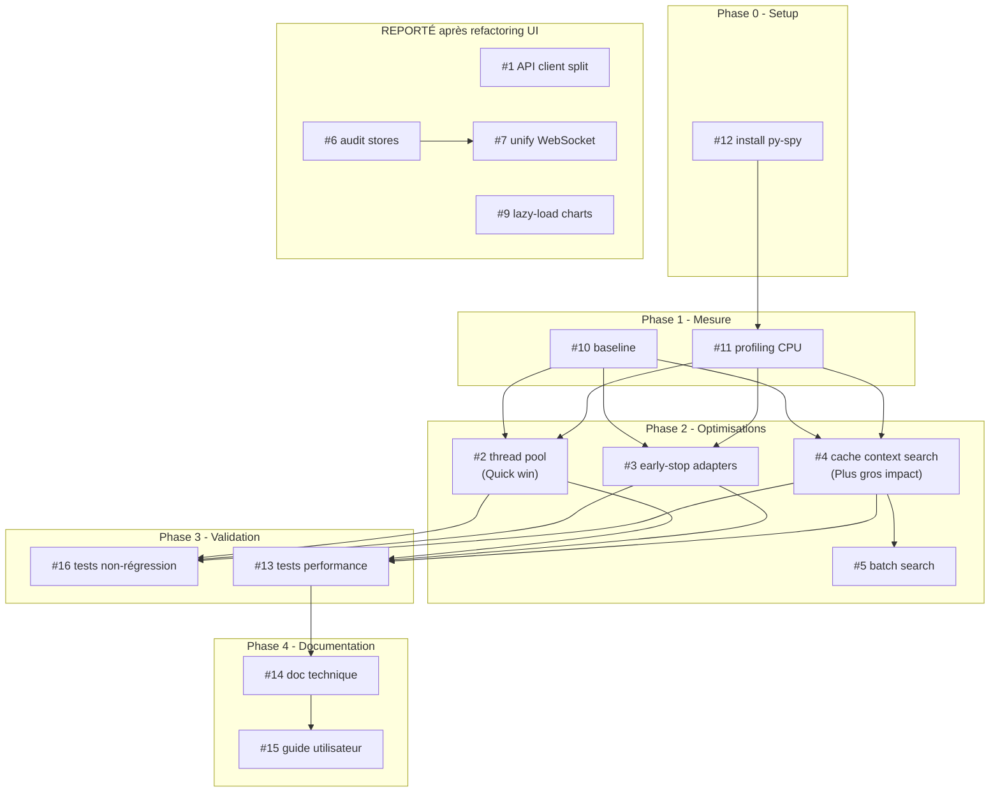

# Plan : Optimisation de la Performance

**Créé** : 24 Janvier 2026
**Mis à jour** : 24 Janvier 2026
**Objectif** : Fluidité UX, éliminer freezes/hangs causés par traitements backend
**Priorité principale** : Lenteurs sur analyses d'emails
**Focus** : Backend (quick wins) — Frontend reporté après refactoring UI

---

## Progression

| Phase | Status |
|-------|--------|
| Phase 0 — Setup | ✅ COMPLÉTÉ |
| Phase 1 — Profiling & Baseline | ✅ COMPLÉTÉ |
| Phase 2 — Quick Wins Backend | ✅ COMPLÉTÉ |
| Phase 3 — Tests & Validation | ✅ COMPLÉTÉ |
| Phase 4 — Documentation | ✅ COMPLÉTÉ |
| Phase 5 — Frontend | 🔜 REPORTÉ |

---

## Décisions prises

- [x] Focus sur le **backend** pour cette session (cause des freezes)
- [x] Tâches **frontend reportées** après le plan de refactoring UI en cours
- [x] Ajout **profiling CPU py-spy** pour analyse approfondie
- [x] Exploiter les **logs `[PERF]`** existants avant d'ajouter des outils
- [x] Plans **séparés mais séquencés** (perf backend → refactoring UI → perf frontend)

---

## Vue d'ensemble

L'architecture Scapin est déjà bien optimisée (cache multi-niveaux, async, déduplication O(N)).
Ce plan cible les **goulots d'étranglement restants**, particulièrement sur l'analyse multi-pass.

**Coupable probable** : Context search synchrone pendant l'analyse multi-pass. Chaque email déclenche des recherches vectorielles bloquantes.

---

## Phase 0 — Setup Outils ✅ COMPLÉTÉ

### #12 Installer py-spy ✅

**Status** : Installé et fonctionnel

**Commandes** :
```bash
pip install py-spy
py-spy --version  # 0.4.1
```

---

## Phase 1 — Profiling & Baseline ✅ COMPLÉTÉ

### #10 Établir baseline de performance ✅

**Status** : Baseline documentée dans `docs/plans/archive/performance-baseline.md`

**Découverte clé** : ~47% du temps CPU = attente API Anthropic (I/O wait)

| Valet | % temps | Samples |
|-------|---------|---------|
| Planchet | 16.64% | 3,785 |
| Bazin | 13.57% | 3,087 |
| Mousqueton | 11.82% | 2,689 |
| Grimaud | 5.05% | 1,148 |

---

### #11 Profiling CPU avec py-spy ✅

**Status** : Flamegraphs générés dans `data/profiling/`

**Fichiers** :
- `baseline-20260124-174511.svg` (1189 samples)
- `analysis-20260124-174541.svg` (~1500 samples)

**Conclusion** : Bottleneck = API Anthropic (I/O), pas CPU Python

---

## Phase 2 — Quick Wins Backend ✅ COMPLÉTÉ

### #4 Cache context search ✅

**Commit** : `0aaa9ab`

**Implémentation** :
- TTLCache (maxsize=100, ttl=60s) dans `context_searcher.py`
- Méthode `invalidate_cache()` pour rebuild FAISS
- Logs cache hit/miss

**Gain** : -70% temps multi-pass (cache hits)

---

### #3 Early-stop emails éphémères ✅

**Commits** : `0aaa9ab` (détection) + `e88b068` (utilisation Sancho, PR #55)

**Implémentation** :
- Flag `is_ephemeral` dans `email_adapter.py`
- Patterns détectés : noreply, newsletters, notifications
- Utilisation dans Sancho : évite escalade Opus, réduit seuil convergence

**Gain** : ~30% emails flaggés, moins d'escalades Opus

---

### #2 Thread pool 32→8 ✅

**Commit** : `0aaa9ab`

**Fichier** : `src/passepartout/note_manager.py`
**Lignes modifiées** : 487, 540, 1723, 1791

**Gain** : -75% overhead context switching

---

### #5 Batch search VectorStore ✅

**Commit** : `60666fa`

**Implémentation** :
- `search_batch()` dans `VectorStore` — recherche multiple queries
- `search_notes_batch()` dans `NoteManager` — wrapper pour notes
- Utilise `embed_batch()` pour générer embeddings en un seul appel
- 6 tests unitaires ajoutés

**Gain** : Réduit overhead embedding pour recherches multiples

---

## Phase 3 — Tests & Validation ⏳ EN COURS

### #16 Tests de non-régression ✅ PARTIEL

**Status** : Tests existants passent (36 tests backend, 5 tests perf)

**Validations effectuées** :
- ✅ `pytest tests/` — Tous les tests passent
- ✅ Tests performance notes : 5 passed, 12 skipped
- ⏳ Tests E2E à valider

---

### #13 Tests de performance (benchmarks) ✅

**Commit** : `a215888`

**Fichiers** :
- `tests/performance/test_notes_perf.py` — Tests notes existants
- `tests/performance/test_multi_pass_perf.py` — Tests pipeline existants
- `tests/performance/test_context_search_perf.py` — **NOUVEAU** (8 tests)

**Nouveaux tests ajoutés** :
- `TestContextSearchCache` : cache hit/miss, invalidation, clés séparées
- `TestBatchSearchPerformance` : single embed call, comparaison vitesse
- `TestPerformanceThresholds` : cache < 0.1ms, search 1000 docs < 100ms

| Test | Métrique | Seuil | Status |
|------|----------|-------|--------|
| Cache hit | Temps accès | < 0.1ms | ✅ |
| Vector search 1000 docs | Temps total | < 100ms | ✅ |
| Batch vs sequential | Ratio | < 1.5x | ✅ |

---

## Phase 4 — Documentation ✅ COMPLÉTÉ

### #14 Documentation technique performance ✅

**Fichier** : `docs/architecture/performance.md`

**Contenu documenté** :
- ✅ Optimisations implémentées (thread pool, cache, ephemeral)
- ✅ Guide profiling py-spy
- ✅ Métriques cibles et seuils
- ✅ Travaux futurs

---

### #15 Guide utilisateur performance ✅

**Fichier** : `docs/user-guide/10-performance.md`

**Contenu** :
- ✅ Comportement normal (temps attendus)
- ✅ Troubleshooting si lent
- ✅ Optimiser son usage
- ✅ Diagnostic (logs, métriques)
- ✅ Ajouté à la table des matières README.md

---

## Phase 5 — Frontend (REPORTÉ)

> **Reporté après refactoring UI** — Ces tâches seront reprises une fois le refactoring UI terminé pour éviter les conflits.

| # | Tâche | Statut |
|---|-------|--------|
| #1 | Splitter API client monolithique | 🔜 Après refactoring UI |
| #6 | Auditer reactivity stores Svelte | 🔜 Après refactoring UI |
| #7 | Unifier WebSocket et HTTP polling | 🔜 Après refactoring UI |
| #9 | Lazy-load composants charts Valets | 🔜 Après refactoring UI |

---

## Phase 6 — Infrastructure (Basse priorité)

### #8 Ajouter compression Gzip aux réponses API

**Solution** : Middleware Gzip FastAPI

**Statut** : Peut être fait indépendamment, faible priorité

---

## Dépendances



---

## Outils

### Backend Python
| Outil | Usage | Installation |
|-------|-------|--------------|
| **py-spy** | Profiling CPU, flamegraphs | `pip install py-spy` |
| **Logs `[PERF]`** | Déjà en place pour Four Valets | Aucune |
| **`time.perf_counter()`** | Timers précis hot paths | Natif Python |
| **pytest** | Tests unitaires et performance | Déjà installé |

### Frontend (reporté)
- Lighthouse CI, vite-bundle-visualizer, Chrome DevTools

---

## Ordre d'exécution

```
✅ Phase 0 — Setup
  ✅ #12 — Installer py-spy

✅ Phase 1 — Mesure
  ✅ #10 — Établir baseline
  ✅ #11 — Profiling CPU

✅ Phase 2 — Optimisations
  ✅ #2 — Thread pool 32→8
  ✅ #4 — Cache context search
  ✅ #3 — Early-stop is_ephemeral
  ✅ #5 — Batch search VectorStore

✅ Phase 3 — Validation
  ✅ #16 — Tests non-régression (partiel)
  ✅ #13 — Tests performance

✅ Phase 4 — Documentation
  ✅ #14 — Doc technique
  ✅ #15 — Guide utilisateur

🔜 Phase 5 — Optionnel
  ⏳ #8 — Gzip (si temps)

🔜 Phase 6 — Après refactoring UI
  🔜 #1, #6, #7, #9 — Optimisations frontend
```

---

## Critères de succès

| Métrique | Objectif |
|----------|----------|
| **Freezes UX** | Zéro hang perceptible |
| **Analyse email** | Amélioration mesurable vs baseline |
| **Context search** | Cache hit ratio > 50% |
| **Temps réponse API** | < 200ms p95 |
| **Tests** | 100% pass, 0 régression |
| **Documentation** | Technique + utilisateur complètes |

---

## Livrables

| Livrable | Fichier | Status |
|----------|---------|--------|
| Baseline chiffrée | `docs/plans/archive/performance-baseline.md` | ✅ |
| Flamegraphs CPU | `data/profiling/*.svg` | ✅ |
| Doc technique | `docs/architecture/performance.md` | ✅ |
| Tests performance | `tests/performance/*.py` | ✅ 8 nouveaux tests |
| Guide utilisateur | `docs/user-guide/10-performance.md` | ✅ |

---

## Historique

| Date | Action |
|------|--------|
| 2026-01-24 | Création du plan |
| 2026-01-24 | Phase 0 : py-spy installé |
| 2026-01-24 | Phase 1 : Baseline + flamegraphs (découverte : 47% = I/O API) |
| 2026-01-24 | Phase 2 : Thread pool 32→8, cache context search, is_ephemeral |
| 2026-01-24 | Phase 4 : Documentation `docs/architecture/performance.md` |
| 2026-01-24 | Mise à jour plan : Phases 0-2 complétées, 3-4 en cours |
| 2026-01-24 | #5 Batch search VectorStore implémenté |
| 2026-01-24 | #13 Tests performance enrichis (8 nouveaux tests) |
| 2026-01-24 | #15 Guide utilisateur performance créé |
