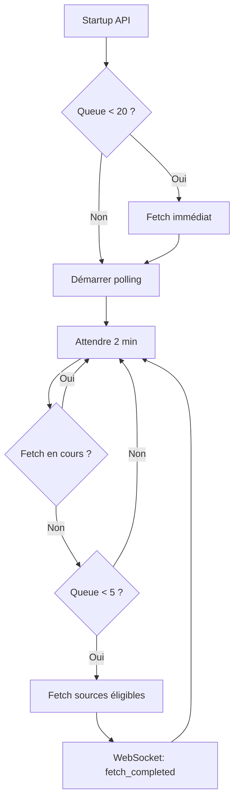
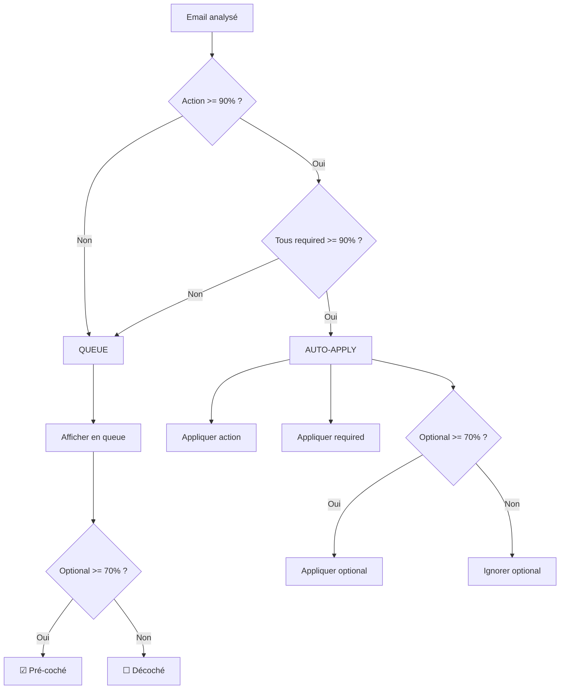

# Plan: Nettoyage Workflow + AutoFetch

**Date** : 2026-01-24
**Statut** : En cours

## Objectif

1. **Garder uniquement Four Valets** - Supprimer le workflow V1 legacy
2. **Implémenter AutoFetch** - Fetch automatique en arrière-plan (SC-20)
3. **Routage par confiance** - Auto-apply haute confiance, queue basse confiance
4. **Documenter** - Workflow clair et maintenable

---

## Phase 1: Nettoyage du Workflow (supprimer V1)

### 1.1 Simplifier `src/trivelin/processor.py`
- **Supprimer** : `_analyze_email()` (single-pass Haiku) - lignes 137-194
- **Supprimer** : Branchement conditionnel V1/V2 - lignes 62-71
- **Garder** : Gestion IMAP, state manager, queue storage
- **Modifier** : Déléguer TOUTE l'analyse à `V2EmailProcessor`

### 1.2 Supprimer le toggle `workflow_v2.enabled`

**Fichiers concernés** :

| Fichier | Modification |
|---------|--------------|
| `src/core/config_manager.py` | Supprimer champ `enabled` de `WorkflowV2Config` |
| `src/trivelin/processor.py` | Supprimer branchement conditionnel |
| `src/frontin/api/routers/workflow.py` | Supprimer vérification ligne 171 (`if not config.workflow_v2.enabled`) |
| `tests/unit/test_workflow_api.py` | Mettre à jour tests qui mockent `enabled` |

V2 devient le seul workflow (toujours actif)

### 1.3 Simplifier `src/frontin/api/services/email_service.py`
- **Supprimer** : Logique de branchement V1/V2 (lignes 96-189)
- **Simplifier** : `process_inbox()` utilise directement `EmailProcessor` qui délègue à V2

### 1.4 Ajouter `process_inbox()` à V2EmailProcessor

⚠️ **Fichier critique** : `src/trivelin/v2_processor.py` — confirmer avant modification

```python
async def process_inbox(
    self,
    limit: int = 50,
    auto_execute: bool = True,
    confidence_threshold: float = 0.85,
) -> list[V2ProcessingResult]:
    """Process emails via Four Valets pipeline."""
```

### 1.5 Vérifier les consommateurs de EmailProcessor

**Ces fichiers utilisent `EmailProcessor` et doivent continuer à fonctionner :**

| Fichier | Usage | Action |
|---------|-------|--------|
| `src/frontin/cli.py` | CLI `scapin process` | Vérifier après modification |
| `src/core/multi_account_processor.py` | Traitement multi-compte | Vérifier après modification |
| `src/frontin/briefing/generator.py` | Génération briefing | Vérifier si concerné |

> Ces fichiers n'ont pas besoin de modification si `EmailProcessor` délègue correctement à V2.

### 1.6 Tests à écrire

**Tests unitaires :**
- [ ] `tests/unit/test_email_processor.py` : Vérifier que `EmailProcessor` délègue correctement à V2
- [ ] `tests/unit/test_v2_processor.py` : Tester `process_inbox()` avec mocks IMAP

**Tests intégration :**
- [ ] `tests/integration/test_workflow_v2_only.py` : Vérifier le pipeline complet sans V1

### 1.7 Validation

```bash
# Tests
.venv/bin/pytest tests/unit/test_email_processor.py tests/unit/test_v2_processor.py -v

# Logs — vérifier absence d'erreurs
grep -E "(ERROR|WARNING)" data/logs/*.json | head -20

# Test manuel CLI
python scapin.py process --limit 1 --verbose
```

---

## Phase 2: Implémentation AutoFetch (SC-20)

### Décisions d'architecture

| Question | Décision |
|----------|----------|
| Trigger | **Polling seul** (pas d'event-driven après approve/reject) |
| Concurrence | **Debounce** (ignorer si fetch en cours) |
| Intervalle | **2 minutes** |
| Défaut | **Activé** par défaut |
| Startup | **Fetch immédiat** si queue < 20 |

### 2.1 Créer `src/frontin/api/services/autofetch_manager.py`

**Singleton avec :**
- `start()` - Démarre la boucle de polling
- `stop()` - Arrête la boucle
- `_polling_loop()` - Boucle async qui vérifie toutes les 2 minutes
- `_check_and_fetch()` - Vérifie queue et fetch si nécessaire
- `is_source_eligible(source)` - Vérifie cooldown par source

**Diagramme du cycle :**



**Logique de polling :**
```python
async def _polling_loop(self):
    while self._running:
        await self._check_and_fetch()
        await asyncio.sleep(120)  # 2 minutes

async def _check_and_fetch(self):
    if self._is_fetching:  # Debounce
        return

    queue_count = await self._get_queue_count()
    if queue_count >= self.config.low_threshold:  # >= 5
        return

    self._is_fetching = True
    try:
        await self._fetch_eligible_sources()
    finally:
        self._is_fetching = False
```

**Cooldowns par source :**
- Email : 2 minutes
- Teams : 2 minutes
- Calendar : 5 minutes

### 2.2 Intégrer au cycle de vie API

**`src/frontin/api/app.py`** (dans `lifespan`) :
```python
# Start AutoFetch background task
autofetch_manager = AutoFetchManager.get_instance()
autofetch_task = asyncio.create_task(autofetch_manager.start())

# Au startup: fetch immédiat si queue < 20
await autofetch_manager.check_and_fetch_if_needed(is_startup=True)

yield

# Shutdown
autofetch_manager.stop()
autofetch_task.cancel()
```

**Note** : Pas de modification de `queue_service.py` (polling seul, pas d'event-driven)

### 2.3 WebSocket events

**`src/frontin/api/websocket/queue_events.py`** :
- `fetch_started` : `{ source: "email" }`
- `fetch_completed` : `{ source: "email", count: 3 }`
- `queue_updated` : `{ pending: 12, processed: 45 }`

### 2.4 Configuration

**`src/core/config_manager.py`** - Ajouter `AutoFetchConfig` :
```python
class AutoFetchConfig(BaseModel):
    enabled: bool = True                    # Activé par défaut
    polling_interval_seconds: int = 120     # 2 minutes
    low_threshold: int = 5                  # Fetch si queue < 5
    max_threshold: int = 20                 # Pas de fetch startup si queue >= 20
    email_enabled: bool = True
    email_cooldown_minutes: int = 2
    teams_enabled: bool = True
    teams_cooldown_minutes: int = 2
    calendar_enabled: bool = True
    calendar_cooldown_minutes: int = 5
```

### 2.5 Tests à écrire

**Tests unitaires :**
- [ ] `tests/unit/test_autofetch_manager.py` : Dé-skipper et implémenter tous les tests
  - Singleton pattern
  - Cooldown tracking
  - Queue threshold checks
  - Debounce behavior
  - Source eligibility

**Tests E2E :**
- [ ] `web/e2e/autofetch.spec.ts` : Vérifier WebSocket events reçus en UI
  - `fetch_started` affiché
  - `fetch_completed` avec count
  - Queue mise à jour automatiquement

### 2.6 Documentation utilisateur

**Ajouter à `docs/user-guide/`** :
- Comment fonctionne le fetch automatique
- Configuration via settings (si exposé en UI)
- Comment désactiver si besoin

### 2.7 Validation

```bash
# Tests unitaires
.venv/bin/pytest tests/unit/test_autofetch_manager.py -v

# Tests E2E
cd web && npx playwright test autofetch.spec.ts

# Logs — vérifier les events AutoFetch
grep -E "(AutoFetch|fetch_started|fetch_completed)" data/logs/*.json | tail -20

# Test manuel
./scripts/dev.sh  # Observer console pour fetch automatique
```

---

## Phase 3: Routage par Confiance (3 seuils)

### Système à 3 seuils

Le routage utilise **3 seuils configurables** et le champ `required` existant sur chaque extraction :

```python
class ConfidenceThresholds(BaseModel):
    """Seuils de confiance pour le routage automatique."""
    action: float = 0.90                # Seuil pour auto-apply action email
    required_enrichment: float = 0.90   # Seuil pour enrichissements obligatoires
    optional_enrichment: float = 0.70   # Seuil pour pré-cocher enrichissements optionnels
```

### Logique de décision : Queue vs Auto-Apply



**Règles :**
- **AUTO-APPLY** si : `Action >= 90%` ET `tous required >= 90%`
- **QUEUE** si : `Action < 90%` OU `au moins un required < 90%`
- **Pré-sélection** : optionnels `>= 70%` cochés par défaut

### Pré-sélection dans la Queue

| Type extraction | Condition | État par défaut |
|-----------------|-----------|-----------------|
| `required=True` | Toujours affiché | ☑ Coché (non modifiable) |
| `required=False`, conf >= 70% | Affiché | ☑ Coché |
| `required=False`, conf < 70% | Affiché | ☐ Décoché |

L'utilisateur peut toujours modifier les optionnels.

### Champ `required` existant

Le champ `required` est **déjà calculé** par `_should_be_required()` dans `multi_pass_analyzer.py` :

| Type | Haute | Moyenne | Basse |
|------|:-----:|:-------:|:-----:|
| deadline | ✓ REQ | ✓ REQ | ✓ REQ |
| decision | ✓ REQ | ○ OPT | ○ OPT |
| engagement | ✓ REQ | ✓ REQ | ○ OPT |
| demande | ✓ REQ | ✓ REQ | ○ OPT |
| montant | ✓ REQ | ○ OPT | ○ OPT |
| fait | ✓ REQ | ○ OPT | ○ OPT |
| evenement | ✓ REQ | ○ OPT | ○ OPT |
| relation | ○ OPT | ○ OPT | ○ OPT |
| contexte | ○ OPT | ○ OPT | ○ OPT |

> L'IA peut override avec `"required": true/false` explicite dans sa réponse.

### Créations de notes → Questions Orphelines

```
┌─────────────────────────────────────────────────────────────────────────┐
│                          CRÉER NOUVELLE NOTE                            │
│  (note_action == "creer")                                               │
│                                                                          │
│  JAMAIS auto-apply → Toujours QUESTION ORPHELINE                        │
│                                                                          │
│  La question apparaît dans le briefing du matin                         │
│  Si user accepte → note créée                                           │
│  Si user refuse → entité blacklistée (avec contexte)                   │
└─────────────────────────────────────────────────────────────────────────┘
```

**Déduplication** :
- Si question en attente existe déjà pour cette entité → ne pas recréer
- Normaliser les noms (lowercase, trim) pour le matching

**Gestion des refus avec contexte** :
```python
# Champs ajoutés à OrphanQuestion
resolution: str  # "accepted" | "rejected"
rejected_entity: str  # Nom normalisé
rejection_context: str  # Projet/expéditeur pour éviter faux positifs homonymes
```

### Unification des seuils

**Constantes à supprimer** (remplacées par `ConfidenceThresholds`) :

| Constante | Fichier | Action |
|-----------|---------|--------|
| `AUTO_APPLY_THRESHOLD` (0.85) | `entities.py` | Supprimer |
| `AUTO_APPLY_THRESHOLD_REQUIRED` (0.80) | `entities.py` | Supprimer |
| `AUTO_APPLY_CONFIDENCE_THRESHOLD` (0.90) | `constants.py` | Supprimer |
| `auto_execute_threshold` (0.85) | `config_manager.py` | Supprimer |
| `auto_apply_threshold` (0.85) | `config_manager.py` | Remplacer par `ConfidenceThresholds` |
| `notify_threshold` (0.70) | `config_manager.py` | Supprimer |

### Modifications `V2EmailProcessor.process_event()`

⚠️ **Fichier critique** : `src/trivelin/v2_processor.py` — confirmer avant modification

```python
def _should_auto_apply(self, analysis: V2Analysis) -> bool:
    """Détermine si l'item doit être auto-apply ou queue."""
    thresholds = self.config.confidence_thresholds

    # 1. Vérifier action
    if analysis.confidence < thresholds.action:
        return False

    # 2. Vérifier tous les enrichissements obligatoires
    for ext in analysis.extractions:
        if ext.note_action == "creer":
            # Créations → question orpheline, jamais auto-apply
            self._create_orphan_question_for_entity(ext)
            continue

        if ext.required and ext.confidence.score < thresholds.required_enrichment:
            return False

    return True

def _get_extractions_to_apply(self, analysis: V2Analysis) -> list[Extraction]:
    """Retourne les extractions à appliquer (pour auto-apply)."""
    thresholds = self.config.confidence_thresholds
    result = []

    for ext in analysis.extractions:
        if ext.note_action == "creer":
            continue  # Géré par questions orphelines

        if ext.required:
            # Obligatoires : toujours inclus si on arrive ici
            result.append(ext)
        elif ext.confidence.score >= thresholds.optional_enrichment:
            # Optionnels : seulement si >= seuil optionnel
            result.append(ext)

    return result
```

### 3.X Tests à écrire

**Tests unitaires :**
- [ ] `tests/unit/test_confidence_routing.py` : Nouveau fichier
  - `test_should_auto_apply_high_confidence` : action 95%, required 92% → True
  - `test_should_queue_low_action_confidence` : action 75% → False
  - `test_should_queue_low_required_confidence` : action 95%, required 65% → False
  - `test_get_extractions_includes_optional_above_threshold` : optional 75% → inclus
  - `test_get_extractions_excludes_optional_below_threshold` : optional 55% → exclus
  - `test_creer_creates_orphan_question` : note_action="creer" → question créée

- [ ] `tests/unit/test_orphan_questions.py` : Tester déduplication et refus avec contexte

**Tests E2E :**
- [ ] `web/e2e/queue-preselection.spec.ts` : Vérifier pré-sélection checkboxes
  - Optional >= 70% : checkbox cochée
  - Optional < 70% : checkbox décochée
  - Required : toujours coché, non modifiable

### 3.Y Documentation utilisateur

**Ajouter à `docs/user-guide/`** :
- Explication du système de confiance (quand un item est auto-traité vs en queue)
- Signification des checkboxes pré-cochés/décochés
- Configuration des seuils (si exposé en settings)

### 3.Z Validation

```bash
# Tests unitaires
.venv/bin/pytest tests/unit/test_confidence_routing.py tests/unit/test_orphan_questions.py -v

# Tests E2E
cd web && npx playwright test queue-preselection.spec.ts

# Logs — vérifier le routage
grep -E "(auto_apply|queue|confidence)" data/logs/*.json | tail -30

# Test manuel
# 1. Traiter un email avec confiance variée
# 2. Vérifier si auto-apply ou queue selon les seuils
# 3. Vérifier les checkboxes dans l'UI queue
```

### Philosophie : Capitalisation vs Questions Jetables

**On n'implémente PAS de questions liées à un seul item.** Au lieu de demander "Quelle action pour cet email ?" :

1. **Enrichissements** : Auto-apply si confiance suffisante
2. **Créations de notes** : Question orpheline qui capitalise la connaissance
3. **Refus mémorisés** : Évite de redemander pour la même entité

→ Le modèle `ClarificationQuestion` devient obsolète. Les incertitudes passent par les questions orphelines.

**Objectif** : Quand l'utilisateur ouvre la queue, tout est déjà pré-analysé.

---

## Phase 4: Documentation

### Décisions d'architecture documentation

| Question | Décision |
|----------|----------|
| Structure | Restructurer `docs/architecture/` avec fichiers dédiés |
| Contenu Workflow | Remplacer "Workflow v2" par "Four Valets" |
| Langue | **Français** |
| AutoFetch | Fichier dédié `docs/architecture/autofetch.md` |
| Diagrammes | **Mermaid** (rendu GitHub) |

### 4.1 Restructurer `docs/architecture/`

**Nouvelle arborescence** :
```
docs/
├── architecture/
│   ├── README.md              # Vue d'ensemble + liens
│   ├── four-valets.md         # Pipeline Grimaud → Bazin → Planchet → Mousqueton
│   ├── confidence-routing.md  # Système 3 seuils, required/optional
│   ├── autofetch.md           # AutoFetch polling, cooldowns, config
│   └── memory-cycles.md       # Retouche/Lecture/Filage (déjà documenté ailleurs?)
├── specs/                     # Inchangé
└── user-guide/                # Inchangé
```

### 4.2 Créer `docs/architecture/four-valets.md`

**Contenu** :
- Philosophie : extraction de connaissance vs triage
- Les 4 valets : Grimaud (triage), Bazin (enrichissement), Planchet (critique), Mousqueton (synthèse)
- Diagramme Mermaid du flux
- Escalade Haiku → Sonnet → Opus
- Lien vers `confidence-routing.md`

### 4.3 Créer `docs/architecture/confidence-routing.md`

**Contenu** :
- Système à 3 seuils (action, required, optional)
- Tableau type × importance → required
- Logique Queue vs Auto-Apply
- Pré-sélection dans la queue
- Créations de notes → Questions orphelines

### 4.4 Créer `docs/architecture/autofetch.md`

**Contenu** :
- Déclencheurs : polling 2 min, startup si queue < 20
- Debounce et cooldowns par source
- Configuration `AutoFetchConfig`
- WebSocket events
- Diagramme Mermaid du cycle

### 4.5 Mettre à jour `ARCHITECTURE.md`

- Remplacer section "Workflow v2" par référence à `docs/architecture/four-valets.md`
- Simplifier : garder vue d'ensemble, détails dans `docs/architecture/`
- Traduire sections anglaises en français
- Mettre à jour TOC

---

## Fichiers par Phase

> ⚠️ = Fichier critique (confirmer avant modification, cf. CLAUDE.md)

### Phase 1 - Nettoyage

| Fichier | Action | Critique |
|---------|--------|:--------:|
| `src/trivelin/processor.py` | Simplifier (supprimer V1, déléguer à V2) | |
| `src/trivelin/v2_processor.py` | Ajouter `process_inbox()` | ⚠️ |
| `src/frontin/api/services/email_service.py` | Simplifier (supprimer branchement V1/V2) | |
| `src/frontin/api/routers/workflow.py` | Supprimer vérification `workflow_v2.enabled` | |
| `src/core/config_manager.py` | Supprimer champ `enabled` de `WorkflowV2Config` | ⚠️ |
| `tests/unit/test_workflow_api.py` | Mettre à jour tests | |

### Phase 2 - AutoFetch

| Fichier | Action | Critique |
|---------|--------|:--------:|
| `src/frontin/api/services/autofetch_manager.py` | **CRÉER** (singleton + polling loop) | |
| `src/frontin/api/app.py` | Intégrer dans `lifespan` (start/stop) | |
| `src/frontin/api/websocket/queue_events.py` | Ajouter events `fetch_started`, `fetch_completed` | |
| `src/core/config_manager.py` | Ajouter `AutoFetchConfig` | ⚠️ |
| `tests/unit/test_autofetch_manager.py` | Implémenter tests (dé-skipper) | |
| `web/e2e/autofetch.spec.ts` | **CRÉER** - Test WebSocket events | |
| `docs/user-guide/autofetch.md` | **CRÉER** - Guide utilisateur | |

### Phase 3 - Routage par Confiance (3 seuils)

| Fichier | Action | Critique |
|---------|--------|:--------:|
| `src/core/config_manager.py` | Ajouter `ConfidenceThresholds` | ⚠️ |
| `src/trivelin/v2_processor.py` | Implémenter `_should_auto_apply()` et `_get_extractions_to_apply()` | ⚠️ |
| `src/trivelin/v2_processor.py` | Créer questions orphelines pour `note_action == "creer"` | ⚠️ |
| `src/integrations/storage/orphan_questions_storage.py` | Ajouter champs refus | |
| `src/frontin/api/services/queue_service.py` | Pré-cocher extractions optionnelles | |
| `src/core/models/v2_models.py` | Supprimer `ClarificationQuestion` (obsolète) | |
| `src/core/entities.py` | Supprimer `AUTO_APPLY_THRESHOLD*` | |
| `src/core/constants.py` | Supprimer `AUTO_APPLY_CONFIDENCE_THRESHOLD` | |
| `tests/unit/test_confidence_routing.py` | **CRÉER** - Tests routage | |
| `tests/unit/test_orphan_questions.py` | **CRÉER** - Tests déduplication | |
| `web/e2e/queue-preselection.spec.ts` | **CRÉER** - Test checkboxes | |
| `docs/user-guide/confidence.md` | **CRÉER** - Guide utilisateur | |

### Phase 4 - Documentation

| Fichier | Action | Critique |
|---------|--------|:--------:|
| `docs/architecture/README.md` | **CRÉER** - Vue d'ensemble + liens | |
| `docs/architecture/four-valets.md` | **CRÉER** - Pipeline + diagramme Mermaid | |
| `docs/architecture/confidence-routing.md` | **CRÉER** - Système 3 seuils | |
| `docs/architecture/autofetch.md` | **CRÉER** - Polling + config | |
| `ARCHITECTURE.md` | Simplifier, références vers `docs/architecture/`, traduire en français | |

---

## Vérification Globale

### Tests unitaires (tous)
```bash
.venv/bin/pytest tests/unit/test_autofetch_manager.py -v
.venv/bin/pytest tests/unit/test_v2_processor.py -v
.venv/bin/pytest tests/unit/test_email_processor.py -v
.venv/bin/pytest tests/unit/test_confidence_routing.py -v
.venv/bin/pytest tests/unit/test_orphan_questions.py -v
```

### Tests intégration
```bash
.venv/bin/pytest tests/integration/test_multi_pass.py -v
```

### Tests E2E
```bash
cd web && npx playwright test autofetch.spec.ts queue-preselection.spec.ts
```

### Test E2E manuel
1. Démarrer le backend : `./scripts/dev.sh`
2. Observer le fetch automatique au démarrage (si queue < 20)
3. Approuver quelques items
4. Vérifier que AutoFetch se déclenche quand queue < 5
5. Vérifier les WebSocket events dans la console
6. Vérifier la pré-sélection des checkboxes selon confiance

### Lint
```bash
.venv/bin/ruff check src/
cd web && npm run check
```

### Validation logs
```bash
# Vérifier absence d'erreurs après toutes les modifications
grep -E "(ERROR|WARNING)" data/logs/*.json | head -30
```

---

## Checklist Avant Commit (par phase)

**Chaque phase doit valider TOUS ces points avant commit :**

```
□ Documentation technique mise à jour (ARCHITECTURE.md ou docs/architecture/)
□ User guide mis à jour si comportement utilisateur modifié (docs/user-guide/)
□ Tests E2E écrits et passants pour tout changement UI
□ Tests unitaires écrits et passants pour tout changement backend
□ Logs vérifiés — aucun ERROR/WARNING nouveau
□ Test manuel effectué — décrire exactement ce qui a été vérifié
□ Ruff : 0 warning
□ TypeScript : npm run check passe
□ Pas de TODO, code commenté, ou console.log laissé
```

**Format de commit** : `type(scope): description`
- Phase 1 : `refactor(workflow): remove V1 legacy, delegate to V2`
- Phase 2 : `feat(autofetch): implement polling-based auto-fetch (SC-20)`
- Phase 3 : `feat(routing): implement 3-threshold confidence routing`
- Phase 4 : `docs: restructure architecture documentation`

---

## Rollback

- Chaque phase est un commit séparé (réversion facile)
- `AutoFetchConfig.enabled = False` désactive AutoFetch sans changement de code
- Le trigger manuel (`POST /api/email/process`) reste fonctionnel
